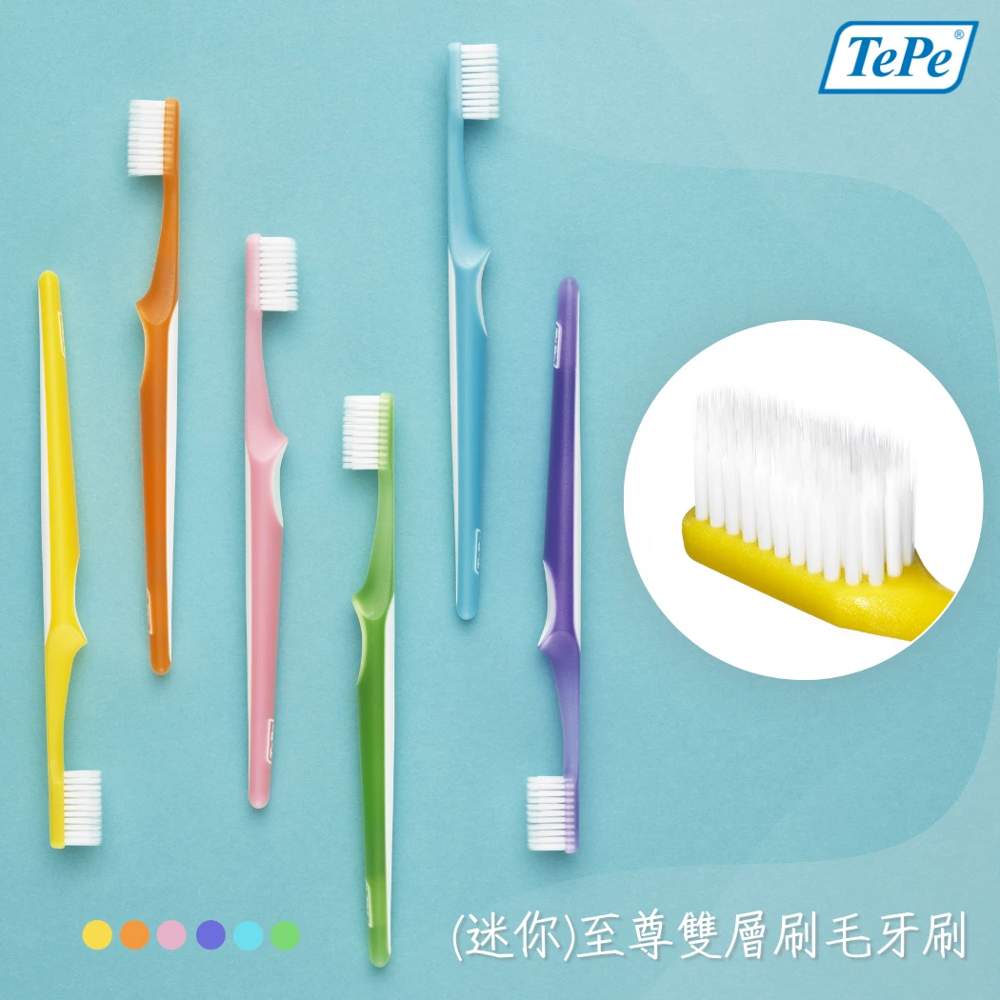
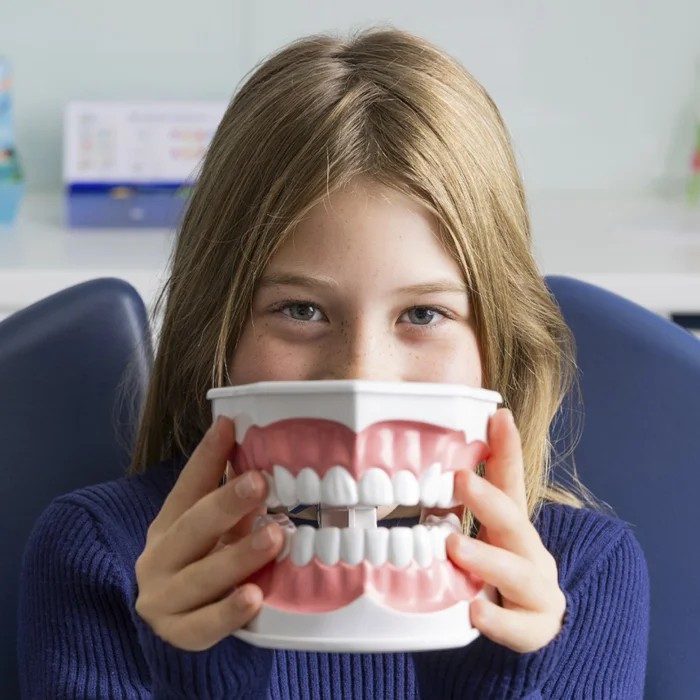

# Facebook 貼文 — 牙刷推薦指南系列

---

## Post 1：軟毛牙刷真的刷不乾淨？

【軟毛牙刷真的刷不乾淨？四個迷思一次破解】

「軟毛感覺沒在刷，應該用硬毛比較乾淨吧？」🤔

這是最常見的牙刷迷思！牙菌斑其實是一層柔軟的細菌膜，軟毛就能輕鬆去除，根本不需要「硬刷」。

硬毛真正造成的後果是：
❌ 牙齦萎縮——而且不可逆
❌ 琺瑯質磨損——牙齒變敏感
❌ 牙根外露——冷熱酸痛找上門

那好牙刷的關鍵是什麼？除了選軟毛，更要注意刷毛是否經過「研磨圓頭處理」🔬 未經處理的刷毛尖端像斷裂的鋼筋，每次刷牙都在微刮你的牙齦。

TePe 每一根刷毛都經過研磨圓頭處理，搭配雙層刷毛設計——內層清潔齒面，外層深入齒縫。用對牙刷，軟毛也能刷得又乾淨又溫和 💪

👉 伸延閱讀: 【2026 牙刷推薦：從日常清潔到術後護理，完整牙刷挑選指南】
https://tepetw.com/blogs/toothbrush/brush-main

TePe® 一般牙刷系列
https://tepetw.com/collections/toothbrushes

---

## Post 2：兒童牙刷怎麼選？爸媽必看的選購重點

【兒童牙刷怎麼選？爸媽必看的選購重點】

幫孩子挑牙刷，千萬別直接買「小號的大人牙刷」！兒童口腔結構和成人完全不同，用錯牙刷不僅清潔效果差，還可能傷害正在發育的牙齦 😣

兒童牙刷分兩階段 👇

🍼 0–3 歲幼兒階段：
・超小刷頭（約 1.6 公分）
・X-soft 超軟刷毛保護脆弱口腔
・方便家長手握的握柄設計
・牙膏用量：米粒大小就好！

🧒 3 歲以上兒童階段：
・刷頭約 2 公分，適合兒童口腔
・人體工學握柄，小手好操控
・Soft 軟毛兼顧清潔力與安全

💡 重要提醒：七歲以前家長仍需協助或監督刷牙！三歲到換牙期正是乳牙與恆牙交替的關鍵時期，口腔清潔品質直接影響恆牙健康。

從第一顆乳牙開始，就幫孩子建立正確的口腔照護習慣 🦷

👉 伸延閱讀: 【2026 牙刷推薦：從日常清潔到術後護理，完整牙刷挑選指南】
https://tepetw.com/blogs/toothbrush/brush-main

TePe® 一般牙刷系列
https://tepetw.com/collections/toothbrushes

---

## Post 3：口腔手術後怎麼刷牙？術後護理三階段

【口腔手術後怎麼刷牙？術後護理三階段】

拔牙、植牙、牙周手術後，很多人因為怕痛就「不敢刷牙」——但牙醫師說，這反而更危險 ⚠️

術後不刷牙，細菌會趁傷口脆弱時大量繁殖，增加感染風險，延遲癒合。關鍵在於：選對工具，溫柔地刷。

術後口腔護理三階段 👇

1️⃣ 術後一週內 → 加護型牙刷
擁有多達 12,000 根超細刷毛（一般牙刷只有約 1,000 根），觸感如絲綢般柔軟，壓力均勻分散，溫柔清潔不碰傷口

2️⃣ 術後一週後 → 防敏感牙刷
過渡階段使用 X-soft 超軟毛，讓恢復中的牙齦逐步適應

3️⃣ 完全恢復後 → 一般軟毛牙刷
回歸日常清潔，搭配正確刷牙技巧維持口腔健康

這條護理路徑也適用於頭頸部放療患者，治療期間口腔黏膜極度脆弱，加護型牙刷是維持口腔衛生的重要工具 💙

👉 伸延閱讀: 【2026 牙刷推薦：從日常清潔到術後護理，完整牙刷挑選指南】
https://tepetw.com/blogs/toothbrush/brush-main

TePe® 特殊牙刷系列
https://tepetw.com/collections/specialty-brushes

---

## Post 4：植牙、矯正、假牙——你需要的不只是一般牙刷

【植牙、矯正、假牙——你需要的不只是一般牙刷】

花了幾萬塊做植牙或矯正，卻還在用「一般牙刷」打天下？小心口腔投資功虧一簣 😱

不同口腔裝置，需要對應的專業清潔工具 👇

🔹 配戴矯正器 → 單頭刷
小型圓頂刷頭像精密工具，專攻托架、鋼線周圍的死角

🔹 單顆/多顆植牙 → 植牙/矯正專用牙刷
窄細長型刷頭從頰側深入植體邊緣，預防植體周圍炎

🔹 ALL-ON-4 全口重建 → 植牙護理牙刷
獨特彎頸＋耙狀刷頭，三個方向清潔假牙底部間隙

🔹 全口活動式假牙 → 假牙專用牙刷
特殊長型刷毛深入凹槽，安全去除食物殘渣不刮傷表面

植牙不會蛀牙，但若清潔不當會引發「植體周圍炎」，嚴重時植體鬆動脫落。選對工具，才能守護你的口腔投資 💪

👉 伸延閱讀: 【2026 牙刷推薦：從日常清潔到術後護理，完整牙刷挑選指南】
https://tepetw.com/blogs/toothbrush/brush-main

TePe® 特殊牙刷系列
https://tepetw.com/collections/specialty-brushes

---

## Post 5：牙刷怎麼選？一張表幫你搞懂

【牙刷怎麼選？依口腔狀況一張表搞懂】

選牙刷不能只看「順眼」！你的口腔狀況決定了你需要哪種牙刷 🔍

快速自我檢測 👇

✅ 牙齦健康、沒有特殊裝置 → 一般軟毛牙刷
✅ 刷牙常出血、牙齦紅腫 → 防敏感牙刷（X-soft）
✅ 剛做完口腔手術 → 加護型牙刷（Ultra-soft）
✅ 戴矯正器 → 一般牙刷 ＋ 單頭刷
✅ 有植牙 → 一般牙刷 ＋ 植牙專用牙刷
✅ 幫小朋友選 → 依年齡分級的兒童牙刷

然後記住選購三原則：
1️⃣ 刷毛選軟毛——硬毛傷牙齦又磨琺瑯質
2️⃣ 刷頭選窄小——才能深入後牙死角
3️⃣ 三個月就要換——刷毛開花等於白刷

⚠️ 還有一個很多人不知道的事：牙刷只能清潔牙齒五個面中的三個面！剩下兩個鄰接面需要搭配牙間刷或牙線，才算完整清潔。

別再隨便拿一支就結帳了，花三分鐘對照你的狀況，選對牙刷才是聰明的健康投資 💙

👉 伸延閱讀: 【2026 牙刷推薦：從日常清潔到術後護理，完整牙刷挑選指南】
https://tepetw.com/blogs/toothbrush/brush-main

TePe® 一般牙刷系列
https://tepetw.com/collections/toothbrushes
