# Instagram 貼文 — 牙刷推薦指南系列

---

## Post 1：輪播貼文 — 軟毛迷思破解：你的牙刷真的夠軟嗎？

**Caption：**
「軟毛牙刷」就一定溫和？那你可能刷錯了 😮

滑動看完 5 張，破解最常見的刷毛迷思 👉

刷毛磨圓、錐形設計、雙層結構⋯⋯差別比你想像的大！

選對刷毛，清潔力 UP、牙齦傷害 DOWN ✨

👉 伸延閱讀: 【2026 牙刷推薦：從日常清潔到術後護理，完整牙刷挑選指南】
https://tepetw.com/blogs/toothbrush/brush-main

TePe® 一般牙刷系列
https://tepetw.com/collections/toothbrushes

**輪播內容建議：**
- Slide 1：「你的軟毛牙刷，刷毛磨圓了嗎？」（磨圓 vs 未磨圓刷毛對比）

  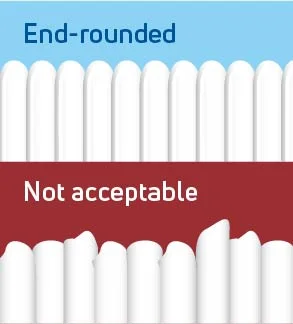

- Slide 2：「錐形刷毛深入牙縫三角地帶」

  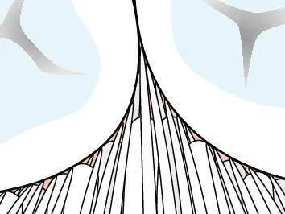

- Slide 3：「鄰面清潔——牙刷碰不到的死角」

  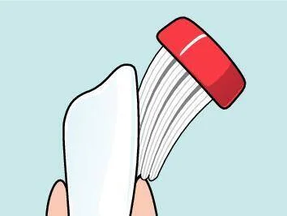

- Slide 4：「雙層刷毛設計：長短交錯更徹底」

  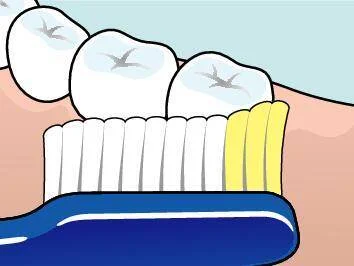

- Slide 5：「刷對方法 × 選對工具 = 至少刷滿 2 分鐘」

  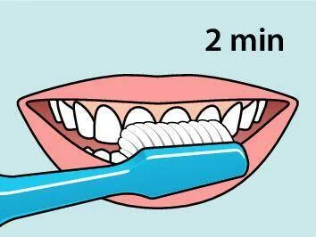

**Hashtags：**
#牙刷推薦 #軟毛牙刷 #刷毛磨圓 #TePe #口腔護理 #牙齒保健 #刷牙 #牙齦護理 #迷思破解 #dentalcare #oralhealth #toothbrush #softbristle #牙醫推薦 #健康生活

---

## Post 2：輪播貼文 — 兒童牙刷怎麼選？分齡攻略一次看

**Caption：**
孩子的牙刷不是「縮小版大人牙刷」就好 🙅

滑動看完 5 張，掌握 0-12 歲分齡選刷重點 👉

刷頭大小、握柄設計、牙膏用量⋯⋯每個階段都不同！

幫孩子養成正確刷牙習慣，從選對牙刷開始 🦷💛

👉 伸延閱讀: 【2026 牙刷推薦：從日常清潔到術後護理，完整牙刷挑選指南】
https://tepetw.com/blogs/toothbrush/brush-main

TePe® 一般牙刷系列
https://tepetw.com/collections/toothbrushes

**輪播內容建議：**
- Slide 1：「0-3 歲：迷你刷頭 × 軟毛 × 好握」

  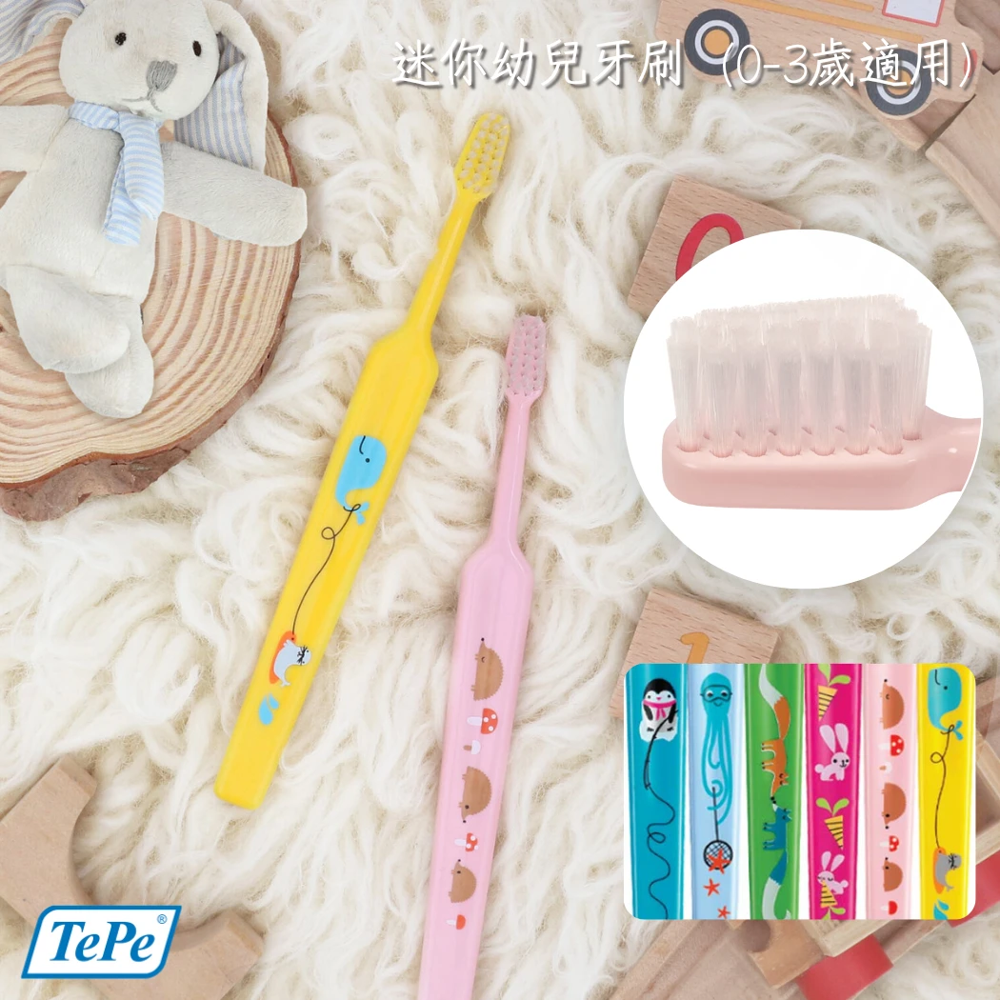

- Slide 2：「0-2 歲牙膏用量：米粒大小即可」

  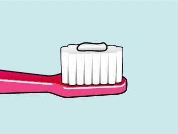

- Slide 3：「3 歲以上：小刷頭 × 防滑握柄」

  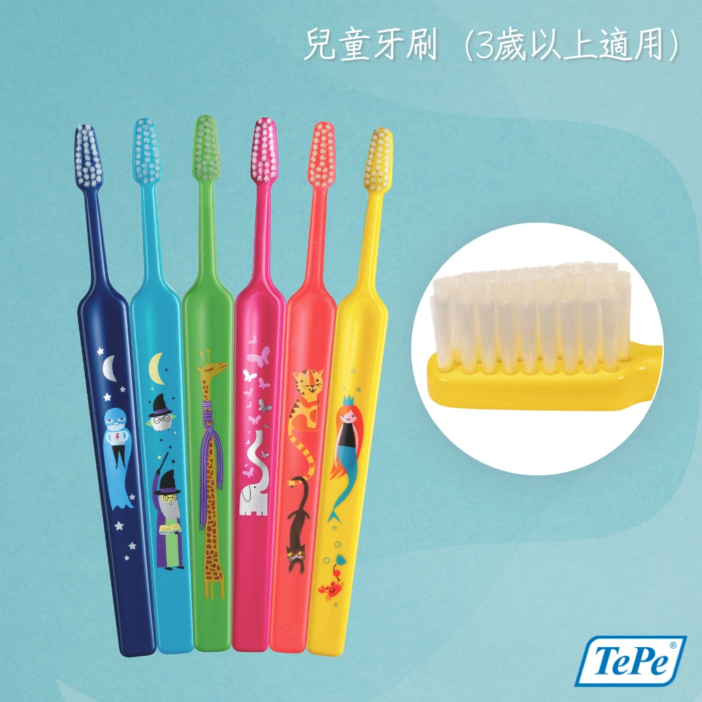

- Slide 4：「3-6 歲牙膏用量：豌豆大小」

  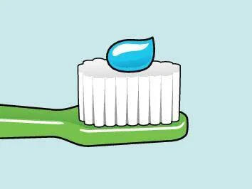

- Slide 5：「上排門牙內側——最容易漏刷的地方」

  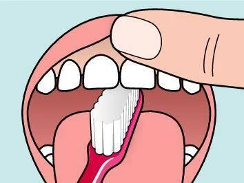

**Hashtags：**
#兒童牙刷 #幼兒牙刷 #兒童口腔 #TePe #牙刷推薦 #親子育兒 #寶寶刷牙 #牙齒保健 #分齡選刷 #dentalcare #kidsdental #toothbrush #parentingtips #牙醫推薦 #口腔健康

---

## Post 3：單圖知識貼 — 術後牙刷：手術後的溫柔守護

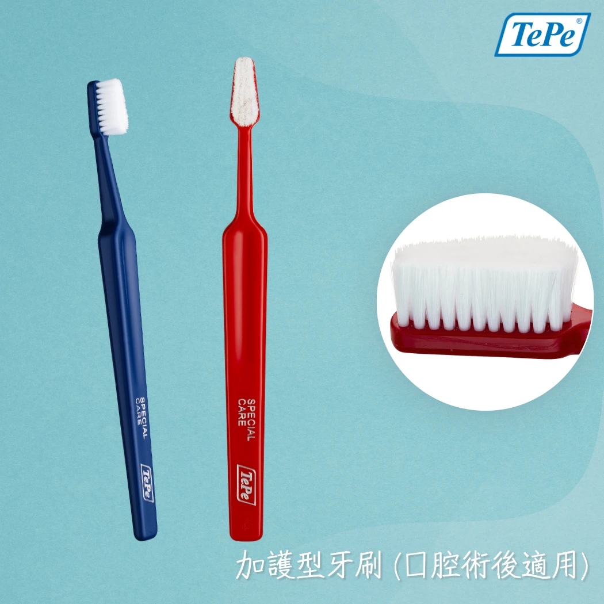

**Caption：**
拔牙、植牙、牙周手術後⋯⋯你知道不能用一般牙刷嗎？🤫

術後傷口脆弱，普通刷毛太硬反而造成二次傷害 ❌

TePe Special Care 加護型牙刷 👇
🪥 12,000 根超細密刷毛（一般牙刷約 1,500 根）
🪥 觸感如棉花般柔軟，溫和不刺激
🪥 術後 1-2 週黃金恢復期的最佳夥伴

醫師有交代術後好好刷牙，但沒說用什麼刷？
答案就是它 💙

👉 伸延閱讀: 【2026 牙刷推薦：從日常清潔到術後護理，完整牙刷挑選指南】
https://tepetw.com/blogs/toothbrush/brush-main

TePe® 特殊牙刷系列
https://tepetw.com/collections/specialty-brushes

**Hashtags：**
#術後護理 #加護型牙刷 #TePe #植牙術後 #拔牙 #牙周手術 #口腔護理 #牙齒保健 #特殊牙刷 #dentalcare #oralhealth #specialcare #postsurgery #牙醫推薦 #口腔健康

---

## Post 4：輪播貼文 — 特殊牙刷圖鑑：你不知道的清潔神器

**Caption：**
除了一般牙刷，還有這些「特殊任務」專用刷 🔍

滑動看完 5 張，認識三種你可能從沒聽過的牙刷 👉

矯正器死角、智齒後方、植牙周圍⋯⋯
普通牙刷刷不到的地方，交給它們 💪

👉 伸延閱讀: 【2026 牙刷推薦：從日常清潔到術後護理，完整牙刷挑選指南】
https://tepetw.com/blogs/toothbrush/brush-main

TePe® 特殊牙刷系列
https://tepetw.com/collections/specialty-brushes

**輪播內容建議：**
- Slide 1：「單頭刷 Compact Tuft——小圓刷頭精準清潔」

  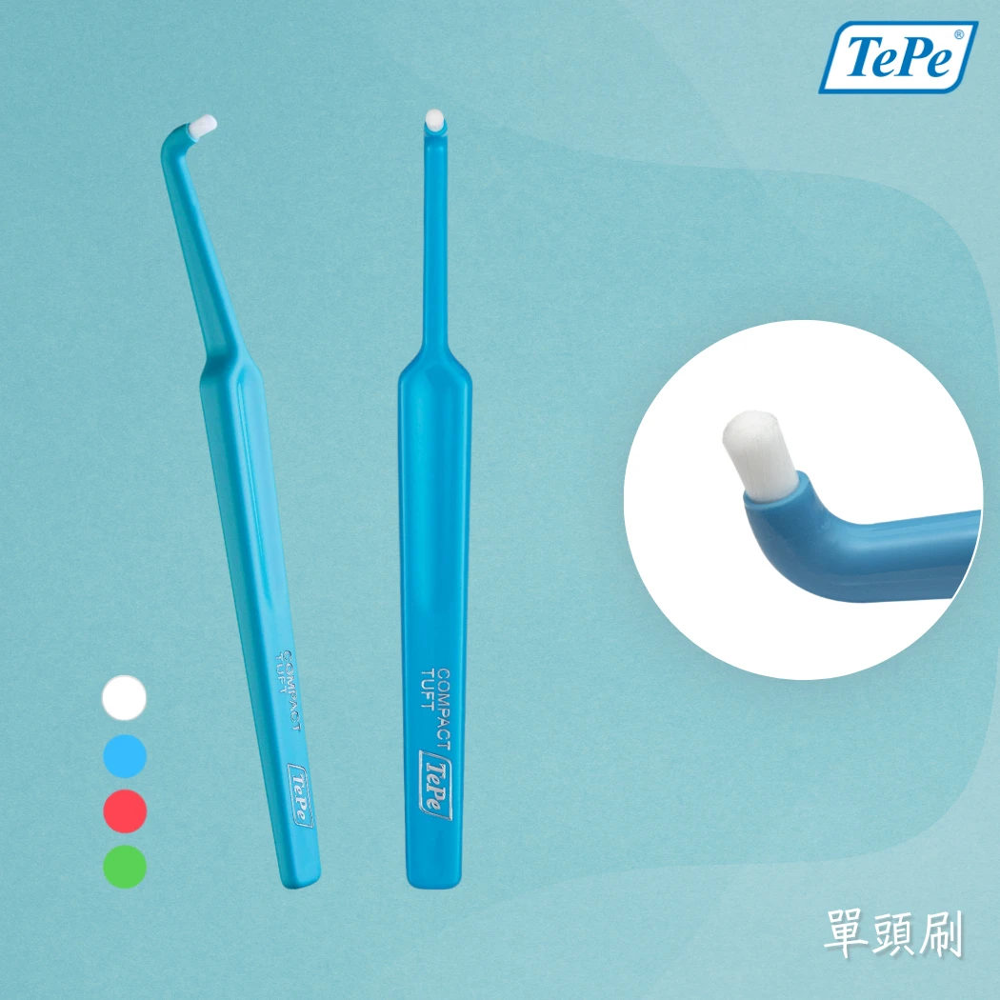

- Slide 2：「智齒後方、最後一顆臼齒——單頭刷的主場」

  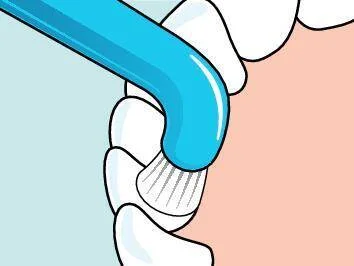

- Slide 3：「間隙專用刷 Interspace——可替換尖頭刷頭」

  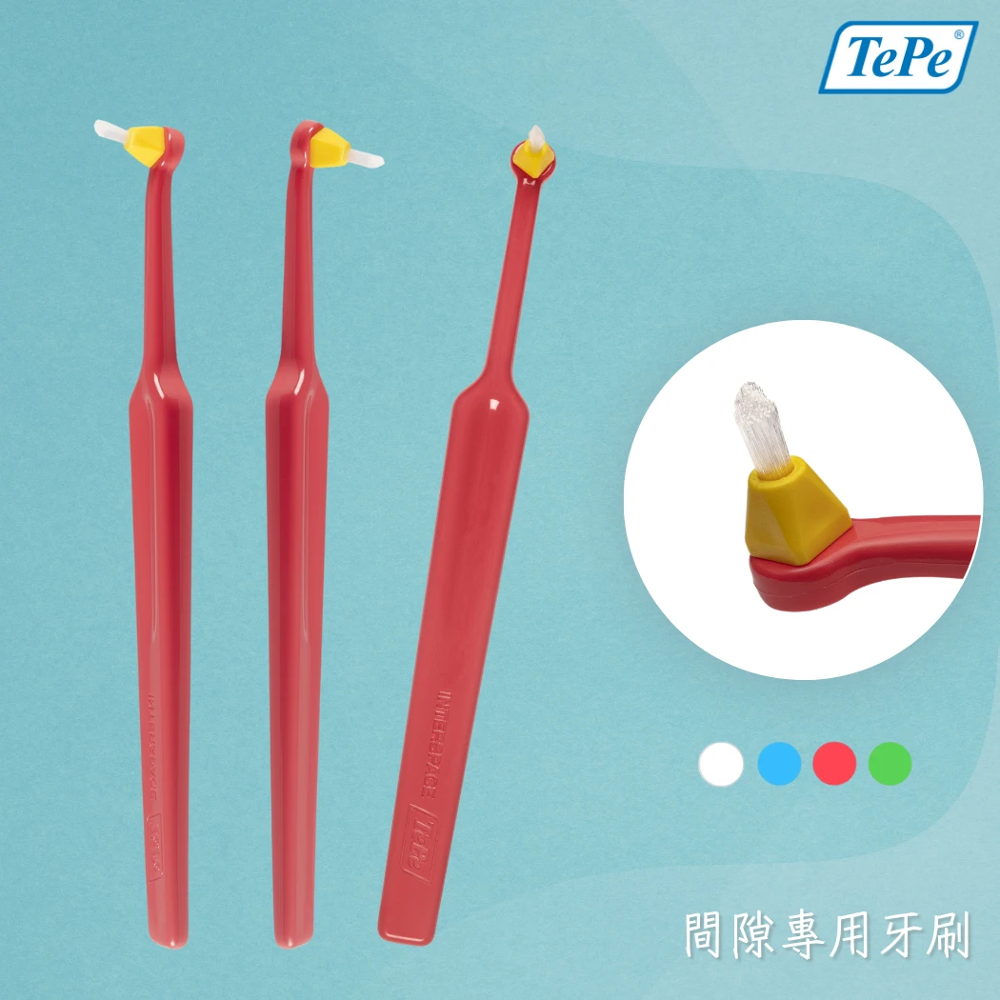

- Slide 4：「植牙護理刷 Implant Care——角度設計貼合植體」

  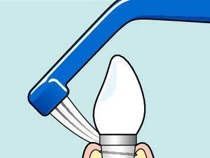

- Slide 5：「矯正 × 植牙雙用刷——一支搞定兩種需求」

  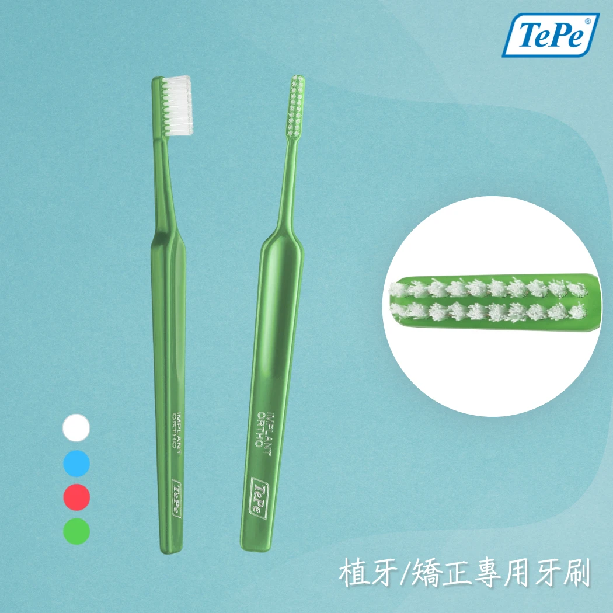

**Hashtags：**
#特殊牙刷 #單頭刷 #植牙護理 #矯正牙刷 #TePe #口腔護理 #牙齒保健 #間隙刷 #智齒清潔 #dentalcare #oralhealth #toothbrush #dentalimplant #braces #牙醫推薦

---

## Post 5：單圖知識貼 — 牙刷選購速查：依口腔狀況對號入座

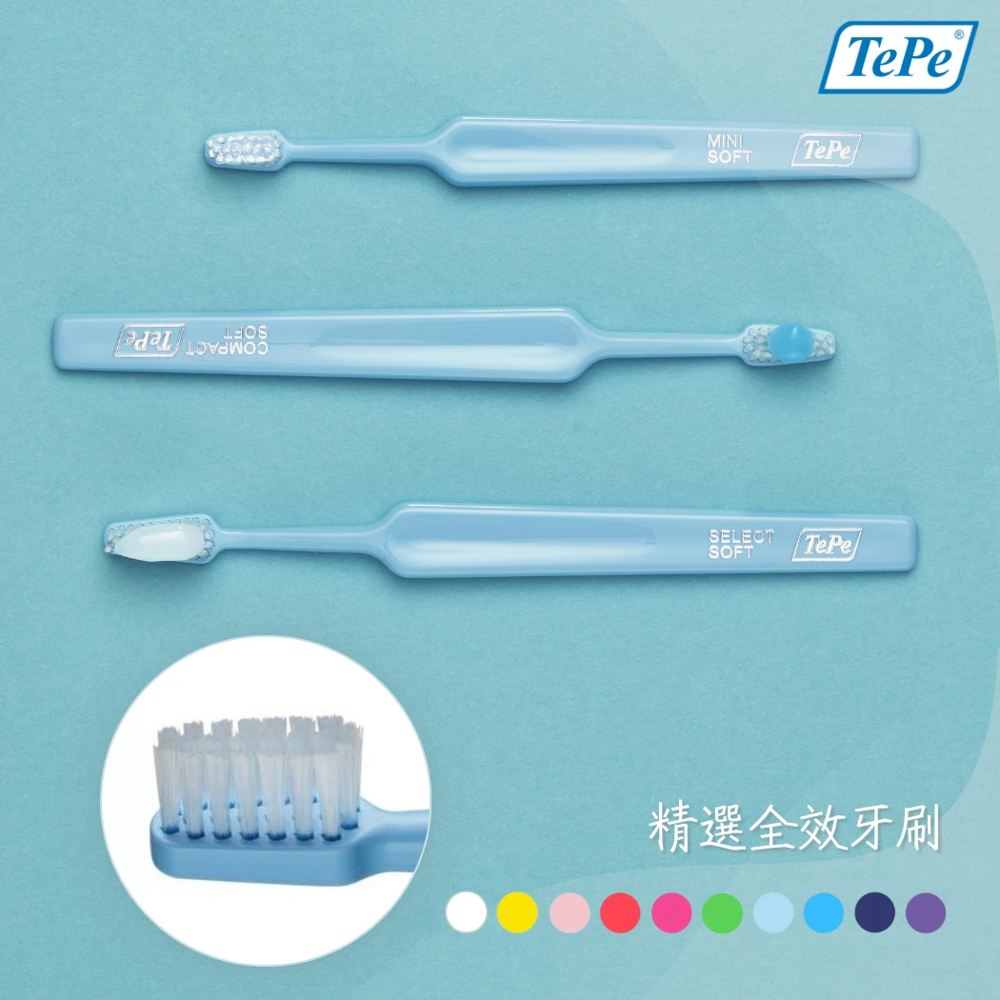

**Caption：**
不確定自己該用哪支牙刷？30 秒對號入座 👇

🟢 一般潔牙 → 精選全效 Select
🔵 深層清潔 → 至尊雙層 Supreme
🟡 敏感牙齦 → 溫和呵護 Good
🔴 術後恢復 → 加護型 Special Care
🟣 矯正 / 植牙 → 單頭刷 / 植牙護理刷

牙刷不是「一支打天下」🙅
找到適合自己口腔狀況的，才是真正有效清潔 ✅

👉 伸延閱讀: 【2026 牙刷推薦：從日常清潔到術後護理，完整牙刷挑選指南】
https://tepetw.com/blogs/toothbrush/brush-main

TePe® 一般牙刷系列
https://tepetw.com/collections/toothbrushes

**Hashtags：**
#牙刷推薦 #牙刷挑選 #TePe #口腔護理 #牙齒保健 #敏感牙齦 #矯正 #植牙 #術後護理 #dentalcare #oralhealth #toothbrush #oralcare #牙醫推薦 #口腔健康