<!--
SEO Title Options:
1. 【2026 牙刷推薦】從日常到術後，完整牙刷挑選指南 (28 chars)
2. 牙刷推薦完全指南：一般、兒童、植牙、矯正牙刷怎麼選？ (26 chars)
3. 2026 牙刷挑選攻略：12 種牙刷類型一次搞懂（含品牌比較） (28 chars)

Recommended: Option 1 — primary keyword front-loaded, year for freshness, covers full scope

Meta Description:
牙刷推薦怎麼選？本指南完整解析一般牙刷、兒童牙刷、術後牙刷、植牙牙刷、矯正牙刷等 12 種類型，含 2026 台灣品牌比較表與情境速查表，幫您依口腔狀況選對牙刷。 (76 chars / 152 bytes)

Target Keywords:
- Primary: 牙刷推薦, 牙刷挑選
- Secondary: 兒童牙刷推薦, 術後牙刷, 敏感牙齦牙刷, 植牙牙刷, 矯正牙刷
- LSI: 軟毛牙刷, 貝氏刷牙法, 牙周病牙刷, 牙刷品牌比較, 牙刷多久換一次
-->

# 【2026 牙刷推薦】從日常清潔到術後護理，完整牙刷挑選指南

您是否曾站在藥局的牙刷架前，面對數十種牙刷卻不知如何下手？大多數人隨手拿一支「看順眼的」就結帳，卻沒想過——選錯牙刷，可能是導致牙齦萎縮、刷牙出血、甚至牙周病惡化的隱形推手。本篇**牙刷推薦指南**將幫您一次搞懂所有牙刷類型。

根據衛福部國民健康署統計，台灣成年人的牙周病盛行率高達八成以上。其中，許多患者的口腔問題並非來自「不刷牙」，而是「用錯工具」。刷毛太硬會磨損琺瑯質與傷害牙齦，刷頭太大則無法深入後牙區，而特殊口腔狀況（如植牙、矯正、術後恢復）更需要對應的專用牙刷。

這篇牙刷挑選指南將帶您有系統地認識各類型牙刷的設計原理與適用情境——從一般軟毛牙刷、兒童牙刷、敏感牙齦牙刷，到植牙牙刷與矯正牙刷——幫助您依據自身口腔狀況做出最聰明的選擇。

## 牙刷挑選的三大關鍵：刷毛、刷頭與握柄

在討論各類型牙刷之前，先建立正確的選購觀念。牙醫師評估一支好牙刷，主要看三個面向：

### 刷毛：軟毛才是王道

許多人直覺認為「硬毛刷得比較乾淨」，但這是最常見的迷思。臨床研究顯示，軟毛與硬毛在清除牙菌斑的效率上並無顯著差異，然而硬毛卻會造成牙齦退縮與琺瑯質磨損。牙醫師普遍建議選擇軟毛（Soft）或超軟毛（Extra Soft / X-soft）牙刷，搭配正確的刷牙技巧，就能達到最佳清潔效果。

此外，刷毛末端是否經過「研磨圓頭處理（End-rounded）」也非常關鍵。未經處理的刷毛末端呈銳利切面，長期使用會刮傷牙齦組織。優質牙刷品牌會在生產過程中逐根研磨，確保每根刷毛的尖端圓滑溫和。

<figure align="center">
  
  <figcaption>左：經過研磨圓頭處理的刷毛末端圓滑溫和；右：未研磨的銳利刷毛容易刮傷牙齦</figcaption>
</figure>

### 刷頭：小而窄，才能深入後牙

刷頭越大不代表清潔效率越高。錐形或窄小的刷頭能更靈活地深入口腔後方，清潔最後一顆臼齒的背面——這正是蛀牙與牙周問題最常發生的位置。

### 握柄：符合人體工學

好的握柄設計能讓您以正確的角度與力道刷牙，減少手部疲勞。彈性可彎曲的刷頸設計，更能讓刷毛貼合牙齒弧度，適應不同角度的清潔需求。

## 一般牙刷推薦：全家人的日常口腔清潔基礎

一般牙刷是每個人最基本的口腔清潔工具。市面上的一般牙刷看似大同小異，但細節設計差異往往決定了清潔品質。以下介紹三種代表性的設計思路：

### 經典全效型

經典的全效型牙刷追求「一支搞定所有需求」。錐形刷頭能深入後牙，研磨圓頭刷毛兼顧清潔力與溫和度，適合大多數成人的日常使用。這類牙刷從兒童到成人都有對應的尺寸，是家庭使用最普遍的選擇。

<figure align="center">
  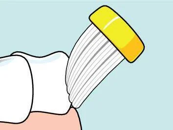
  <figcaption>錐形刷毛設計能有效貼合牙齦邊緣，清潔齒面與牙齦溝</figcaption>
</figure>

### 雙層刷毛型

雙層刷毛是近年來備受關注的設計創新。外層較長的纖細刷毛能深入牙縫與牙齦溝，清除一般刷毛無法觸及的牙菌斑；內層較短的刷毛則負責齒面的大面積清潔。這種「分工合作」的設計，讓每一次刷牙都能同時照顧到齒面與齒縫。

<figure align="center">
  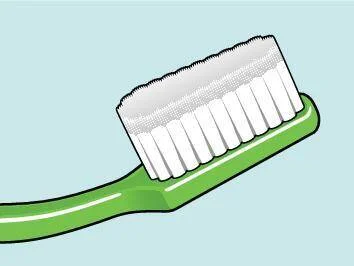
  <figcaption>雙層刷毛設計：長短不同的刷毛各司其職，實現全方位清潔</figcaption>
</figure>

<figure align="center">
  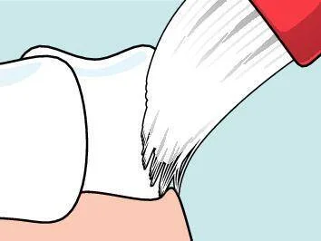
  <figcaption>外層纖細刷毛深入牙齦溝與牙縫邊緣，帶走隱藏的牙菌斑</figcaption>
</figure>

### 深層潔淨型

深層潔淨型牙刷結合尖型刷毛與圓頭刷毛兩種設計。尖型刷毛擅長深入齒縫等狹窄空間，圓頭刷毛則溫和清潔齒面。搭配可彎曲刷頸，在清潔後牙內側與舌側時特別有優勢。

<figure align="center">
  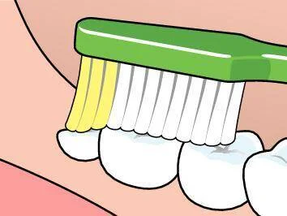
  <figcaption>尖型刷毛深入牙齦溝，圓頭刷毛同步清潔齒面</figcaption>
</figure>

## 兒童牙刷推薦：從第一顆乳牙開始的口腔照護

兒童的口腔結構與成人截然不同，使用成人牙刷不僅清潔效果差，還可能傷害正在發育的牙齦與乳牙。依照年齡，兒童牙刷大致分為兩個階段：

### 0 至 3 歲：幼兒牙刷

從寶寶長出第一顆乳牙開始，就應該使用幼兒專用牙刷進行清潔。這個階段的牙刷需具備以下特點：

- **超小刷頭**（約 1.6 公分）：能放入幼兒小巧的嘴巴
- **X-soft 超軟刷毛**：不傷害脆弱的牙齦與口腔黏膜
- **適合家長手掌的握柄**：方便家長幫寶寶刷牙

牙膏用量方面，兩歲以下建議使用「薄薄一層（米粒大小）」的含氟牙膏，兩歲以上可增加至「碗豆大小」。

<figure align="center">
  
  <figcaption>兩歲以下幼兒牙膏用量：薄薄一層約米粒大小即可</figcaption>
</figure>

<figure align="center">
  
  <figcaption>兩歲以上兒童牙膏用量：約碗豆大小</figcaption>
</figure>

### 3 歲以上：兒童牙刷

三歲以上的兒童開始學習獨立刷牙，此階段的牙刷需兼顧「好握」與「好清潔」。刷頭約 2 公分，比幼兒牙刷稍大但仍適合兒童口腔。符合人體工學的握柄弧度，讓小手更容易掌控刷牙力道。

特別提醒：**七歲以前家長仍應協助或監督刷牙**，確保每個齒面都被清潔到位。三歲到換牙期正是乳牙與恆牙交替的關鍵時期，口腔清潔品質直接影響恆牙的健康發育。

<figure align="center">
  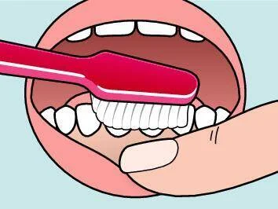
  <figcaption>兒童牙刷的纖細刷頭能靈活深入後牙區，徹底清潔臼齒咬合面</figcaption>
</figure>

## 特殊牙刷：針對特定口腔需求的專業解方

並非所有人都只需要一支「一般牙刷」。特殊口腔狀況——無論是疾病、手術還是口腔裝置——都需要對應的專業牙刷。以下逐一介紹六大類特殊牙刷的設計原理與適用族群。

### 敏感牙齦牙刷推薦：牙周病與敏感牙齦的日常夥伴

牙周病是台灣成人最普遍的口腔疾病。根據國民健康署的調查，超過八成的台灣成年人有不同程度的牙周問題。患者牙齦經常紅腫易出血，使用一般軟毛牙刷仍可能造成不適，導致許多患者因害怕疼痛而減少刷牙頻率——這形成了一個惡性循環：越不刷牙，牙周狀況越嚴重，刷牙時就越痛，就更不想刷牙。

防敏感牙刷正是為了打破這個惡性循環而設計。它採用比一般軟毛更加纖柔的刷毛技術，在不刺激發炎牙齦的前提下，維持有效的牙菌斑清除力。緻密而柔軟的刷毛讓牙周病患者能夠持續維持每日刷牙的習慣，逐步改善牙齦健康。同時也適合口乾症（乾燥症候群）患者，口腔乾燥會使黏膜變得脆弱，柔軟刷毛能減少對乾燥口腔黏膜的摩擦與傷害。

**適用族群**：牙周病患者、牙根敏感者、口乾症患者、口腔手術恢復期一週後的過渡使用

### 術後牙刷推薦：口腔手術後的溫柔守護

拔牙、植牙手術、牙周翻瓣手術或口腔黏膜手術後的一週內，口腔處於最脆弱的狀態。一般牙刷即使是軟毛款，仍可能刺激傷口導致疼痛或延遲癒合。然而，牙醫師強調，即使在手術後也不應完全停止刷牙——保持口腔清潔是促進傷口癒合、減少感染風險的關鍵。

加護型牙刷通常擁有超高密度的超細刷毛（例如多達 12,000 根），觸感如絲綢般柔軟，能在術後最敏感的時期安心清潔。一般牙刷的刷毛大約只有一千多根，而加護型牙刷的超高密度設計，讓刷牙時的壓力均勻分散到每一根刷毛上，大幅降低對傷口的單點壓力，是術後護理的最佳選擇。

對於接受頭頸部放射線治療的癌症患者，治療期間口腔黏膜極度脆弱敏感，一般牙刷幾乎無法使用。加護型牙刷的超細刷毛能溫和完成日常清潔，是放療期間維持口腔衛生的重要工具。

**術後口腔照護路徑**：術後一週內使用加護型牙刷 → 術後一週後過渡至防敏感牙刷 → 完全恢復後回歸一般軟毛牙刷

### 單頭刷：精準清潔每一個死角

單頭刷的外型與一般牙刷截然不同——小型圓頂形刷頭，刷毛緊密排列成單束狀，就像一支微型的精密清潔工具。它不是用來取代一般牙刷，而是作為「第二支牙刷」，專門對付那些一般刷頭無法到達的死角。

<figure align="center">
  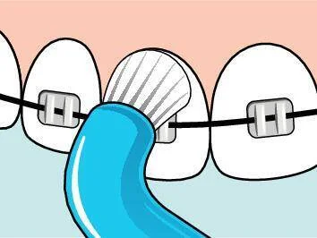
  <figcaption>單頭刷精準清潔矯正器托架周圍的牙菌斑堆積</figcaption>
</figure>

**單頭刷的五大應用場景**：

1. **矯正器周圍**：托架與鋼線交接處的食物殘渣
2. **智齒區域**：最後方臼齒的背面與內側
3. **植牙邊緣**：植體底座周圍的精細清潔
4. **牙橋底部**：固定假牙與牙齦之間的空隙
5. **排列不齊的牙齒**：擁擠或旋轉牙齒的隱蔽面

<figure align="center">
  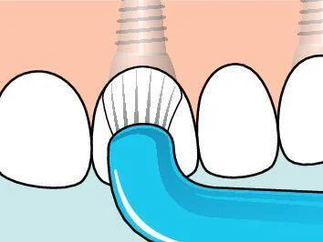
  <figcaption>單頭刷沿著植體基台邊緣清潔，預防植體周圍炎</figcaption>
</figure>

<figure align="center">
  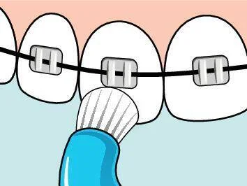
  <figcaption>單頭刷深入鋼線下方，清除一般牙刷無法觸及的死角</figcaption>
</figure>

### 間隙專用牙刷：矯正與牙周的好幫手

間隙專用牙刷採用單束錐形刷頭，比單頭刷更加纖細，專門用於極為狹窄的口腔結構清潔。其最大特色是**可替換式刷頭**設計，能根據使用需求更換不同類型的刷頭，經濟又環保。

<figure align="center">
  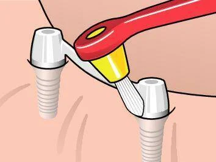
  <figcaption>錐形刷頭深入植體底座與牙齦之間的空間，精準清除牙菌斑</figcaption>
</figure>

**最適合的清潔場景**：植體周圍縫隙、牙周治療後的牙根分叉區域、矯正器鋼線與托架周圍、牙橋邊緣

<figure align="center">
  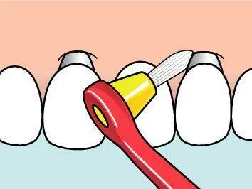
  <figcaption>間隙專用牙刷清潔牙橋與牙齦的交界處</figcaption>
</figure>

### 植牙牙刷與矯正牙刷：守護您的口腔投資

植牙的長期成功取決於日常清潔。植體不會蛀牙，但若周圍牙菌斑清潔不當，會引發「植體周圍炎」，嚴重時導致植體鬆動脫落——等於數萬元的投資付諸流水。

**植牙護理牙刷**具有獨特的彎頸設計與耙子形刷頭，能從頰面、舌面與顎面三個方向清潔植體。特別適合 ALL-ON-4 全口重建患者，耙狀刷頭能貼合假牙底部弧度，深入清潔假牙與牙齦之間的間隙。

<figure align="center">
  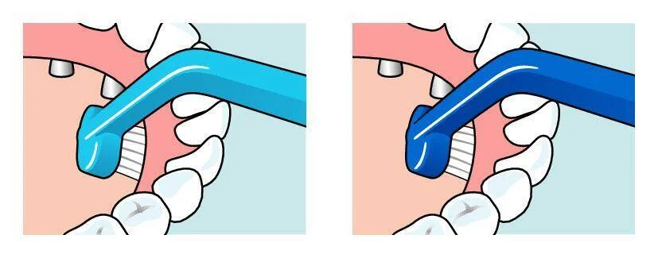
  <figcaption>彎頸設計讓刷頭能從各角度深入植體區域清潔</figcaption>
</figure>

**植牙/矯正專用牙刷**則擁有窄細的長型刷頭與纖細刷頸，能從頰側輕鬆深入植牙區域或矯正裝置旁的狹窄空間。無論是傳統金屬矯正器、隱形牙套取下後的清潔，或是植體邊緣的日常維護，都能精準應對。

<figure align="center">
  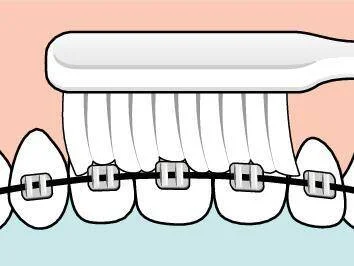
  <figcaption>窄細刷頭穿梭於矯正托架與鋼線之間，徹底清潔裝置周圍的牙菌斑</figcaption>
</figure>

<figure align="center">
  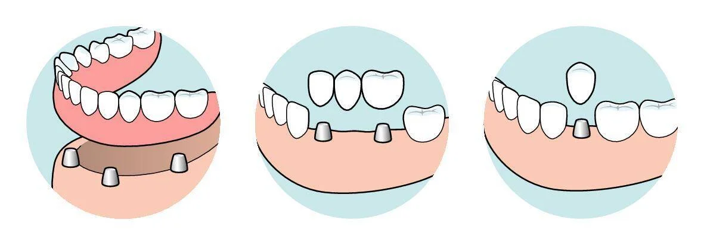
  <figcaption>常見植牙修復方式：單顆植牙、植牙牙橋、ALL-ON-4 全口重建</figcaption>
</figure>

### 全口假牙專用牙刷

全口假牙（活動式假牙）的清潔需求與自然牙完全不同。假牙每天與口腔黏膜密切接觸，若清潔不當會孳生細菌，導致口臭甚至口腔感染。

全口假牙專用牙刷採用特殊長型刷毛設計，柔韌有彈性，能深入假牙的凹槽與縫隙，安全去除附著的食物殘渣與細菌薄膜，同時不刮傷假牙表面。部分產品提供可加熱彎曲的刷頭設計，讓使用者能以更理想的角度清潔假牙內側。

<figure align="center">
  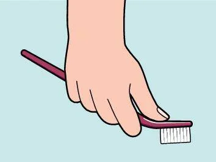
  <figcaption>人體工學握柄設計，即使手部靈活度較低的長輩也能輕鬆操作</figcaption>
</figure>

## 2026 台灣市場牙刷品牌深度比較

台灣消費者可以接觸到來自世界各國的牙刷品牌，各有不同的設計哲學與產品定位。以下是市面上主要品牌的客觀比較，幫助您依據自身需求做出選擇：

| 品牌 | 產地 | 核心技術特色 | 特殊牙刷產品線 | 價格定位 | 主要通路 |
| --- | --- | --- | --- | --- | --- |
| 高露潔 Colgate | 美國 | 超纖細刷毛、高密度刷毛叢 | 較少（以一般牙刷為主） | 平價 | 超市、便利商店 |
| 獅王 Lion (Systema) | 日本 | 極細刷毛深入牙齦溝、抗菌刷毛 | 牙周護理系列 | 平價至中價 | 藥局、超市 |
| Oral-B | 德國 | 交叉刷毛設計、電動牙刷為強項 | 牙齦護理系列 | 平價至中價 | 賣場、藥局 |
| 舒酸定 Sensodyne | 英國 | 中間長四周短刷毛排列、深度清潔 | 敏感型專用 | 中價 | 藥局 |
| Curaprox | 瑞士 | 5,460 根 Curen® 超細刷毛 | 單束刷、術後刷 | 高價 | 牙科診所、電商 |
| GUM (Sunstar) | 日本 | 極柔軟刷毛、牙周護理導向 | 術後刷、單束刷 | 中價 | 藥局 |
| TePe 緹碧 | 瑞典 | 研磨圓頭刷毛、雙層刷毛、可彎曲刷頸 | 最完整（涵蓋術後、植牙、矯正、假牙、兒童等全系列） | 中價至高價 | 牙科診所、電商 |

**選購建議**：

- **日常基礎清潔**：各品牌的軟毛牙刷都能勝任，選擇刷頭大小適合自己的即可
- **牙周病或敏感牙齦**：優先考慮有專業牙周護理系列的品牌
- **植牙、矯正、術後護理**：需要選擇有完整特殊牙刷產品線的品牌，一般品牌較少涵蓋這些品項
- **兒童**：選擇有依年齡分級、通過安全檢測（不含雙酚 A）的兒童專用牙刷

## 依照口腔狀況選擇牙刷：情境速查表

| 您的口腔狀況 | 建議牙刷類型 | 原因 |
| --- | --- | --- |
| 一般健康成人 | 一般軟毛牙刷 | 基礎清潔即可滿足需求 |
| 牙齦容易出血 | 防敏感牙刷（超軟毛） | 減少刷毛對發炎牙齦的刺激 |
| 拔牙 / 植牙手術後一週內 | 加護型牙刷 | 超高密度刷毛如絲綢般溫柔 |
| 術後恢復期（一週後） | 防敏感牙刷 | 從加護型過渡至日常清潔 |
| 配戴矯正器 | 一般牙刷 ＋ 單頭刷 | 單頭刷清潔托架與鋼線周圍死角 |
| 單顆或多顆植牙 | 一般牙刷 ＋ 植牙/矯正專用牙刷 | 窄細刷頭深入植體邊緣 |
| ALL-ON-4 全口重建 | 植牙護理牙刷 | 耙狀刷頭清潔假牙底部 |
| 全口活動式假牙 | 全口假牙專用牙刷 | 特殊刷毛不刮傷假牙表面 |
| 0-3 歲嬰幼兒 | 迷你幼兒牙刷 | 超小刷頭、超軟刷毛 |
| 3 歲以上兒童 | 兒童牙刷 | 尺寸適合兒童口腔與小手 |

## 正確刷牙方式：貝氏刷牙法重點提醒

即使選對了牙刷，錯誤的刷牙方式仍會大打折扣。牙醫師最推薦的「貝氏刷牙法（Modified Bass Technique）」重點如下：

1. **刷毛角度 45 度**：將刷毛朝向牙齦，以約 45 度角輕放在牙齒與牙齦的交界處
2. **小幅度水平震動**：以兩到三顆牙齒為單位，輕輕水平來回震動約十次
3. **由外到內、由後到前**：依序清潔外側面 → 內側面 → 咬合面
4. **刷牙時間至少兩分鐘**：許多人實際刷牙時間不到一分鐘，這遠遠不夠
5. **力道要輕**：用力過猛只會傷害牙齦，不會刷得更乾淨

## 常見問題 FAQ

### 多久該換一次牙刷？

一般建議每三個月更換一次牙刷。若發現刷毛開始分叉、彎曲或失去彈性，即使不到三個月也應立即更換。生病（如感冒、流感）後也建議換新牙刷，避免殘留細菌造成重複感染。

### 電動牙刷比手動牙刷好嗎？

電動牙刷（尤其是聲波震動式）確實能在相同時間內提供更多的刷毛震動次數，對於刷牙技巧不佳或手部活動受限的人來說是不錯的選擇。但研究顯示，使用正確技巧的手動牙刷，清潔效果與電動牙刷並無顯著差異。關鍵在於「刷牙技巧」而非「牙刷價格」。

此外，電動牙刷無法取代特殊牙刷的功能——植牙護理、矯正清潔、術後照護等場景仍需要對應的專用手動牙刷。

### 牙刷需要消毒嗎？

日常使用後只需用流動清水徹底沖洗、甩乾水分，放置在通風處晾乾即可。不建議用熱水煮沸或微波消毒，高溫會使刷毛變形失效。最重要的原則是：**不要多人共用同一支牙刷**，這是避免口腔細菌交叉感染的基本衛生常識。

## 結語：好牙刷是口腔健康的第一道防線

牙刷是我們每天使用兩次、一年使用超過七百次的親密工具。然而，大多數人從未認真思考過自己用的牙刷是否真正適合自身的口腔狀況。花一點時間了解不同牙刷的設計原理與適用情境，選擇真正適合的類型，就能在日常清潔中事半功倍。

無論您是需要基礎日常清潔的一般消費者、正在與牙周病奮戰的患者、剛完成口腔手術的恢復者、配戴矯正器需要加強清潔的矯正族，還是為孩子挑選第一支牙刷的新手爸媽——市面上都有針對您需求專門設計的專業工具。

口腔健康不僅影響牙齒本身，研究也顯示牙周疾病與心血管疾病、糖尿病等全身性健康問題存在關聯。從選對一支牙刷開始，建立正確的口腔清潔習慣，就是對全身健康最簡單、最有效的長期投資。

別忘了，牙刷只是完整口腔清潔的一部分。搭配[牙間刷](https://tepetw.com/collections/idb)清潔牙縫，才能將牙垢清除率從 60% 提升至 90% 以上。

探索適合您的牙刷推薦：[一般牙刷系列](https://tepetw.com/collections/toothbrushes) ｜ [特殊牙刷系列](https://tepetw.com/collections/specialty-brushes) ｜ [兒童牙刷系列](https://tepetw.com/collections/children-toothbrush)
