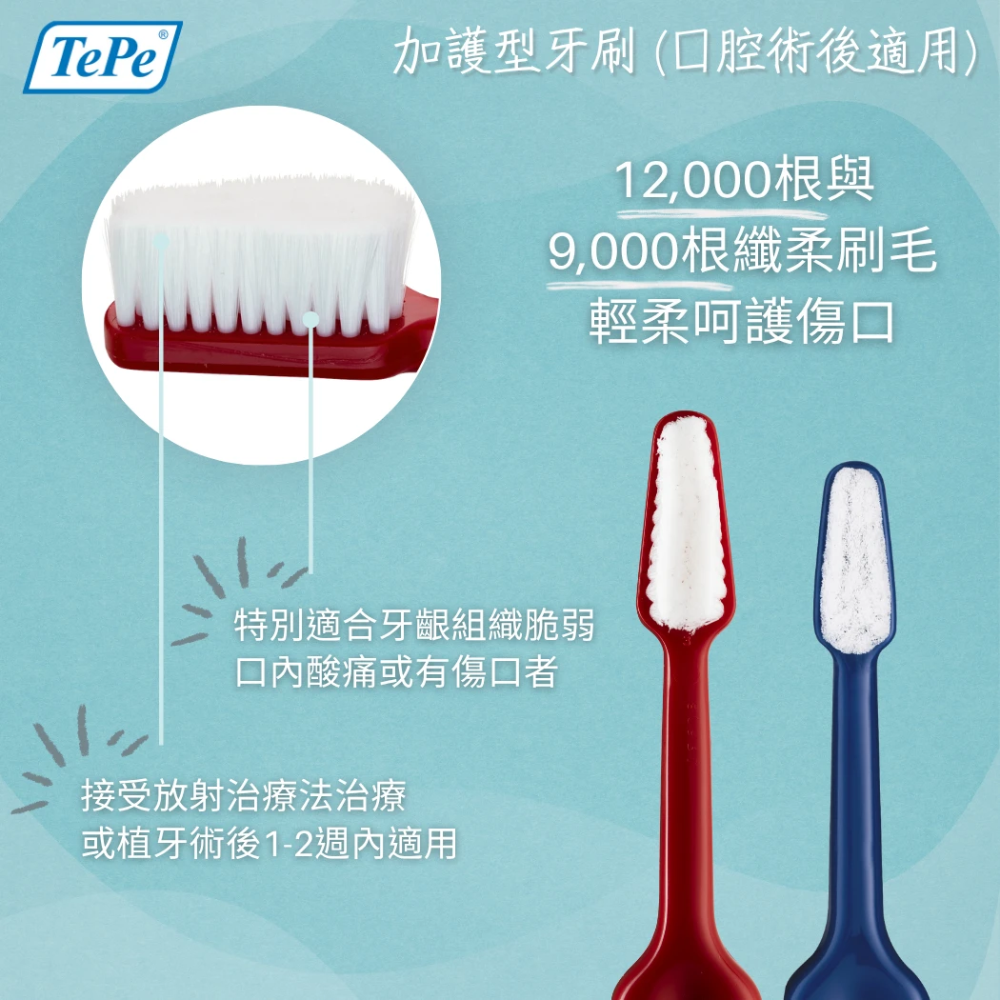
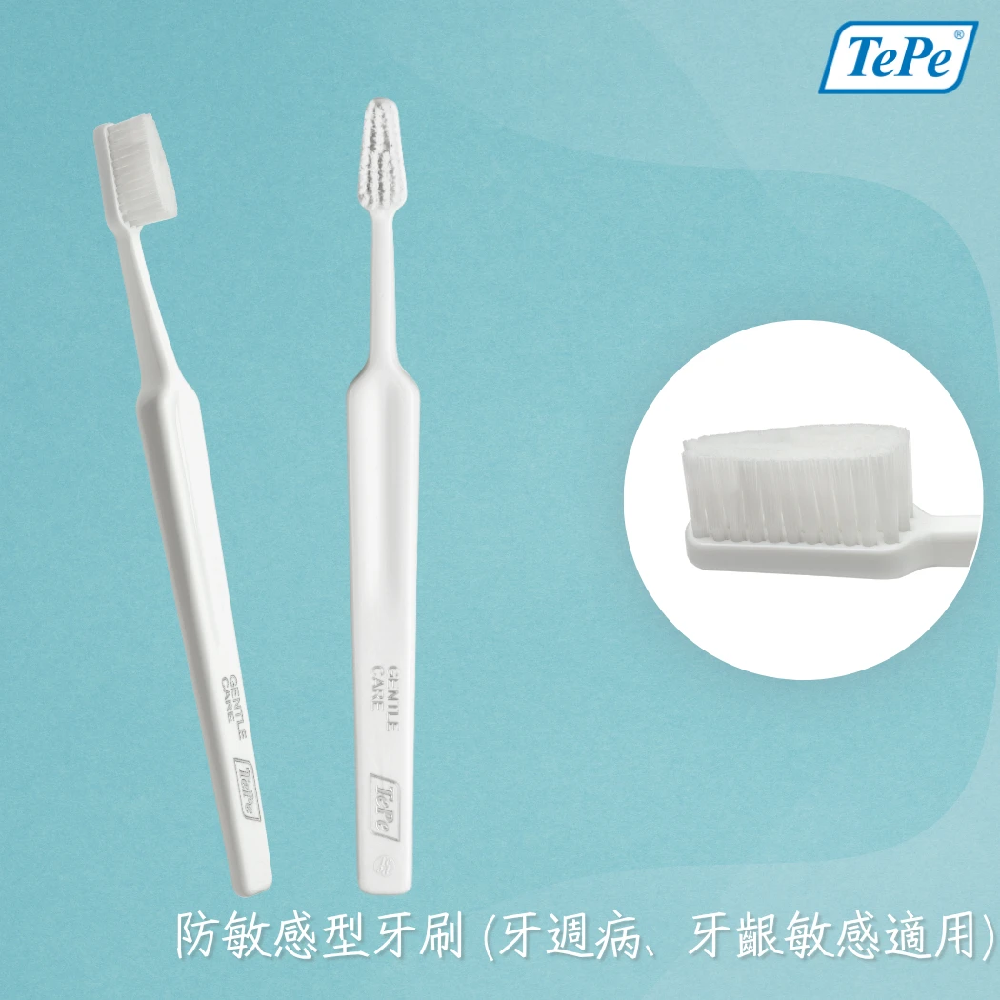

<!--
SEO Title: 術後牙刷推薦：口腔手術後的護理路徑與敏感牙齦牙刷選擇指南
Meta Description: 口腔手術後該用什麼牙刷？本文解析加護型牙刷（12,000根刷毛）與防敏感牙刷（5,400根刷毛）的差異，並提供術後三階段護理路徑，適合植牙、牙周手術、放療患者參考。
Target Keywords:
- Primary: 術後牙刷, 敏感牙齦牙刷
- Secondary: 口腔手術後刷牙, 牙周病牙刷推薦, 放療口腔護理
- LSI: 超軟毛牙刷, 加護型牙刷, 牙周翻瓣手術, 術後口腔清潔
-->

# 術後牙刷與敏感牙齦牙刷：口腔手術後的護理路徑

拔牙、植牙、牙周翻瓣手術剛結束，口腔裡的傷口隱隱作痛——這時候，你可能最不想做的事情就是刷牙。但牙醫師會告訴你：**術後最需要做的事，正是維持口腔清潔**。問題不在於「要不要刷」，而是「用什麼刷」。這篇文章將帶你認識兩種專為脆弱口腔設計的牙刷，以及一條清晰的術後過渡路徑。

## 為什麼術後不能停止刷牙？

口腔是人體細菌密度最高的區域之一。手術後的傷口如果被牙菌斑包圍，不僅容易感染，還會延遲癒合速度。臨床研究顯示，術後維持良好口腔衛生的患者，傷口癒合速度顯著快於口腔清潔不佳者。

然而，術後的口腔異常敏感。一般軟毛牙刷約有 1,000 至 1,500 根刷毛，刷牙時的壓力集中在相對少量的刷毛上，對健康牙齦不成問題，卻可能對手術傷口造成明顯疼痛甚至二次傷害。這正是許多患者術後不敢刷牙的根本原因，而「不敢刷牙」往往導致感染風險上升，形成惡性循環。

打破這個循環的關鍵，就在於選擇正確的術後牙刷。

## 加護型牙刷：12,000 根刷毛的極致溫柔

加護型牙刷（Special Care）是專為**口腔最脆弱時刻**設計的極致溫和清潔工具。它最大的特點，是將多達 **12,000 根超細刷毛**密集排列在刷頭上——這個數字是一般牙刷的八到十倍。

<figure align="center">
  
  <figcaption>加護型牙刷擁有多達 12,000 根超細刷毛，觸感如絲綢般柔軟</figcaption>
</figure>

超高密度帶來的物理優勢很直觀：當相同的刷牙力道被分散到 12,000 根刷毛上，每一根刷毛對口腔組織施加的壓力極為微小。你幾乎感覺不到刷毛的存在，卻依然能有效帶走牙菌斑。

<figure align="center">
  
  <figcaption>超高密度刷毛將刷牙壓力均勻分散，術後最脆弱的口腔也能安心清潔</figcaption>
</figure>

**加護型牙刷的適用族群**：

- **拔牙、植牙、牙周翻瓣手術**後一週內的患者
- **口腔黏膜手術**恢復期間
- **頭頸部放射線治療**的癌症患者——放療會導致口腔黏膜極度脆弱，一般牙刷幾乎無法使用，加護型牙刷是放療期間維持口腔衛生的重要工具
- 任何口腔黏膜**嚴重破損或潰瘍**期間

## 防敏感牙刷：牙周病患者的日常夥伴

如果說加護型牙刷是「急性期」的守護者，那防敏感牙刷（Gentle Care）就是**長期護理**的可靠夥伴。它搭載 **5,400 根柔軟刷毛**，比一般軟毛牙刷密集許多，又比加護型牙刷略為紮實，能在溫和與清潔力之間取得平衡。

<figure align="center">
  
  <figcaption>防敏感牙刷以 5,400 根柔軟刷毛，溫和守護發炎中的牙齦</figcaption>
</figure>

防敏感牙刷最核心的使命，是幫助**牙周病患者維持每日刷牙的習慣**。台灣超過八成成年人有不同程度的牙周問題，牙齦紅腫與出血讓許多人因害怕疼痛而逃避刷牙。然而，越不刷牙牙周狀況越差，越差就越痛——防敏感牙刷正是為了打破這個惡性循環而存在。

**防敏感牙刷的適用族群**：

- **牙周病患者**：牙齦長期發炎、容易出血
- **牙齦萎縮者**：牙根外露導致敏感
- **口乾症（乾燥症候群）患者**：唾液不足使口腔黏膜變得脆弱，柔軟刷毛能減少摩擦傷害
- **術後恢復期過渡**：從加護型牙刷過渡回一般牙刷的中間階段

## 術後口腔照護路徑：三階段過渡

術後口腔護理不是「選一支牙刷用到底」，而是隨著傷口復原逐步過渡。以下是牙醫師建議的三階段護理路徑：

**第一階段｜術後 0–7 天：加護型牙刷**
傷口最脆弱的一週內，使用 12,000 根超細刷毛的加護型牙刷。以極輕力道、小幅度動作清潔所有齒面，傷口周圍尤其需要耐心。此階段的目標不是「刷到完美乾淨」，而是「維持基本清潔，避免感染」。

**第二階段｜術後 1–4 週：防敏感牙刷**
傷口初步癒合後，可過渡至 5,400 根刷毛的防敏感牙刷。它的清潔力比加護型稍強，能更有效清除牙菌斑，同時仍對尚在修復中的牙齦保持溫和。牙周病患者在此階段可能需要長期使用防敏感牙刷作為日常工具。

**第三階段｜完全恢復後：一般軟毛牙刷**
當牙醫師確認傷口完全癒合、牙齦恢復健康，就可以回歸一般軟毛牙刷。回歸後仍建議選擇研磨圓頭處理的優質軟毛牙刷，從根本預防牙齦問題復發。

每個人的恢復速度不同，實際過渡時間請依照你的主治牙醫師建議調整。重要的是記住這個原則：**牙刷的選擇應隨著口腔狀態一起「升級」，而非一成不變。**

---

延伸閱讀：[2026 牙刷推薦完整指南](brush-main) | 選購：[TePe 特殊牙刷系列](https://tepetw.com/collections/specialty-brushes)
