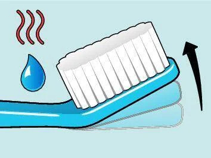
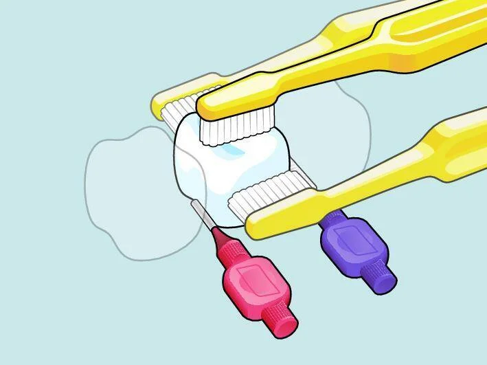
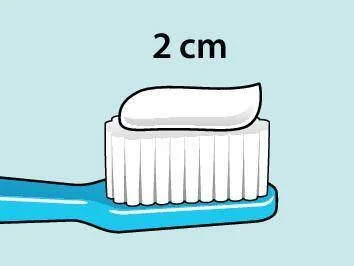

# 牙刷怎麼選？依口腔狀況一張表搞懂

站在賣場的牙刷架前，面對幾十種牙刷，你是不是也「隨便拿一支」就結帳？其實，牙刷選對與否，直接影響你的牙齦健康和清潔效率。本篇幫你從三大原則出發，搭配**口腔狀況速查表**，三分鐘找到最適合你的那支牙刷。

## 選牙刷的三大原則

不管品牌或價格，牙醫師評估一支好牙刷主要看三個面向：

**1. 刷毛軟硬度：選軟毛就對了**

硬毛給人「刷得很乾淨」的錯覺，但牙菌斑只是一層柔軟的細菌膜，軟毛搭配正確技巧就能有效清除。硬毛反而容易磨損琺瑯質、導致牙齦萎縮，造成不可逆的傷害。日常清潔選 Soft，牙齦敏感選 X-soft，術後短期選加護型（Ultra-soft）。

**2. 刷頭大小：小而窄才能深入後牙**

刷頭越大不代表效率越高。錐形或窄小的刷頭更容易伸進口腔最後方，徹底清潔智齒背面——這正是蛀牙和牙周問題最常出現的位置。

**3. 握柄與刷頸：符合人體工學**

好的握柄讓你以正確角度輕鬆刷牙，減少手部疲勞。可彎曲的刷頸設計能讓刷毛更貼合牙齒弧度，清潔後牙內側時特別有優勢。部分牙刷甚至支援用熱水微調刷頭角度，讓清潔更加個人化。

<figure align="center">
  
  <figcaption>部分牙刷支援熱水彎曲功能，讓刷頭角度更適合個人口腔結構</figcaption>
</figure>

## 依口腔狀況速查：你該用哪種牙刷？

| 口腔狀況 | 建議牙刷類型 | 刷毛等級 | 重點說明 |
| --- | --- | --- | --- |
| 一般健康成人 | 一般軟毛牙刷 | Soft | 錐形刷頭＋研磨圓頭刷毛即可滿足日常需求 |
| 牙齦容易出血 / 牙周病 | 防敏感牙刷 | X-soft | 超軟毛減少對發炎牙齦的刺激，維持刷牙習慣 |
| 口腔手術後一週內 | 加護型牙刷 | Ultra-soft | 12,000 根超密刷毛分散壓力，溫柔清潔傷口周圍 |
| 術後恢復期（一週後） | 防敏感牙刷 | X-soft | 從加護型過渡至日常清潔的中間階段 |
| 配戴矯正器 | 一般牙刷 ＋ 單頭刷 | Soft | 單頭刷清潔托架、鋼線周圍死角 |
| 單顆 / 多顆植牙 | 一般牙刷 ＋ 植牙專用牙刷 | Soft | 窄細刷頭深入植體邊緣，預防植體周圍炎 |
| ALL-ON-4 全口重建 | 植牙護理牙刷 | Soft | 耙狀刷頭清潔假牙與牙齦間的間隙 |
| 全口活動式假牙 | 假牙專用牙刷 | — | 特殊長型刷毛深入凹槽，不刮傷假牙表面 |
| 0–3 歲嬰幼兒 | 迷你幼兒牙刷 | X-soft | 超小刷頭配合家長手握的握柄設計 |
| 3 歲以上兒童 | 兒童牙刷 | Soft | 尺寸符合兒童口腔，人體工學握柄方便小手操控 |

> 不確定自己的狀況？最簡單的方法是帶著目前使用的牙刷去看診，請牙醫師根據你的口腔狀況直接建議。

## 牙刷之外：別忘了牙縫清潔

很多人以為「認真刷牙」就等於口腔清潔做到位，但事實上，**牙刷只能清潔牙齒五個面中的三個面**——外側、內側和咬合面。兩顆牙齒之間的鄰接面，牙刷的刷毛根本伸不進去。

<figure align="center">
  
  <figcaption>每顆牙齒有五個面需要清潔，牙刷負責三面，牙間刷負責兩側鄰接面</figcaption>
</figure>

這代表即使你每天認真刷牙兩次，仍有約 30–40% 的牙齒表面處於「沒被清潔」的狀態。這些牙縫中殘留的牙菌斑，正是造成牙齦發炎、牙周病和蛀牙的主要元兇。

解決方案很簡單：**牙刷 ＋ 牙間刷（或牙線）** 才是完整的口腔清潔組合。牙間刷能深入牙縫，360 度清除鄰接面的牙菌斑，搭配牙刷使用，清潔率可從約 60% 提升至 90% 以上。

## 三個最常見的牙刷使用錯誤

**錯誤一：使用中硬毛或硬毛牙刷**

「刷起來有感覺」不等於「刷得乾淨」。硬毛牙刷長期使用會造成牙齦退縮和琺瑯質磨損，而且這些損傷無法自然恢復。牙菌斑是柔軟的細菌膜，軟毛就能有效去除。

**錯誤二：牙刷超過三個月還不換**

刷毛會隨使用時間逐漸分叉、失去彈性，清潔力明顯下降。建議每三個月更換一次。如果刷毛已經「開花」外翻，不到三個月也該立刻更換。感冒或流感痊癒後，同樣建議換新牙刷，避免殘留病菌。

<figure align="center">
  
  <figcaption>成人每次刷牙的牙膏用量約 2 公分即可，不需要擠滿整個刷頭</figcaption>
</figure>

**錯誤三：刷牙方式不正確**

最常見的問題是大幅度橫刷——像鋸木頭一樣來回拉鋸，這會磨損牙頸部的齒質。正確的貝氏刷牙法是：刷毛 45 度角朝向牙齦，以兩到三顆牙齒為單位，小幅度水平震動。力道放輕，每次刷牙至少兩分鐘，別忘了舌側面和咬合面都要顧到。

---

延伸閱讀：[2026 牙刷推薦完整指南](brush-main) | 選購：[TePe 一般牙刷系列](https://tepetw.com/collections/toothbrushes) ｜ [TePe 特殊牙刷系列](https://tepetw.com/collections/specialty-brushes)
