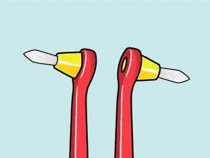
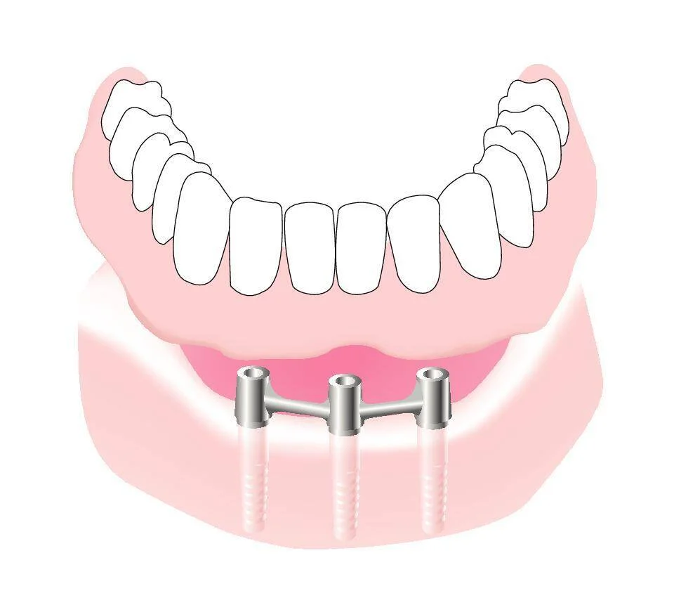

<!--
SEO Title: 植牙、矯正必備：5 種特殊牙刷完全解析｜單頭刷、間隙刷、植牙護理刷
Meta Description: 植牙後該用什麼牙刷？矯正期間怎麼清潔托架？本文完整解析單頭刷、間隙專用牙刷、植牙護理牙刷、植牙矯正專用牙刷與全口假牙刷等 5 種特殊牙刷的功能與適用情境。
Target Keywords:
- Primary: 植牙牙刷, 矯正牙刷, 特殊牙刷
- Secondary: 單頭刷, 間隙專用牙刷, 植牙護理牙刷, 假牙刷
- LSI: ALL-ON-4 清潔, 矯正器清潔, 牙橋清潔, 植體周圍炎
-->

# 植牙、矯正必備：5 種特殊牙刷完全解析

花了數十萬做植牙，或是忍受兩年矯正的不便，最怕的是什麼？答案不是手術失敗或矯正反彈，而是**清潔不到位導致的二次問題**。植體周圍炎、矯正期蛀牙、假牙口臭——這些都能靠正確的特殊牙刷預防。這篇文章為你拆解五種特殊牙刷的設計邏輯與使用場景，讓你知道自己到底需要哪一支。

## 單頭刷：口腔死角的精密清潔專家

單頭刷（Tuft Brush）是所有特殊牙刷中用途最廣的一支。它的外型與一般牙刷截然不同——小型圓頂形刷頭上，刷毛緊密排列成單束狀，就像一支微型的精密清潔工具。

<figure align="center">
  
  <figcaption>單頭刷的小型圓頂刷頭能輕鬆深入最後一顆臼齒的背面</figcaption>
</figure>

單頭刷不是用來取代一般牙刷，而是作為**「第二支牙刷」**，專門對付那些一般刷頭永遠碰不到的死角。它的核心價值在於「精準」——你可以像拿筆一樣控制它，逐點清潔每一個狹窄空間。

**單頭刷的五大應用場景**：

1. **矯正器周圍**：托架與鋼線交接處是食物殘渣的重災區，一般牙刷的大刷頭根本無法進入
2. **智齒與最後臼齒背面**：這是蛀牙與牙周病最常發生的位置，也是一般牙刷最難觸及的區域
3. **植牙邊緣**：植體底座與牙齦之間的交界需要精細清潔，預防植體周圍炎
4. **牙橋底部**：固定假牙底面與牙齦之間的空隙容易藏污納垢
5. **排列不齊的牙齒**：擁擠或旋轉牙齒的隱蔽面，只有小刷頭才能深入

如果你只能選一支特殊牙刷，**單頭刷的泛用性最高**，幾乎適合所有有口腔裝置或牙齒排列問題的人。

## 間隙專用牙刷：可替換刷頭的經濟之選

間隙專用牙刷（Interspace Brush）的外觀乍看與單頭刷相似，但仔細觀察會發現關鍵差異——它的刷頭呈**錐形尖端**，刷毛從底部到頂端逐漸收窄，能精準插入極為狹窄的空間。

<figure align="center">
  
  <figcaption>間隙專用牙刷的錐形刷頭設計，精準清潔極為狹窄的口腔結構</figcaption>
</figure>

與單頭刷不同的是，間隙專用牙刷最大的優勢之一是**刷頭可替換**。你只需要購買一支握柄，之後定期更換刷頭即可，長期使用下來比每次購買整支牙刷更為經濟。

**適合使用間隙專用牙刷的情境**：

- **牙橋邊緣**：錐形刷頭能沿著假牙與牙齦的接縫滑動清潔
- **植體底座周圍**：比單頭刷更能深入極狹窄的植體周圍空間
- **牙齦邊緣精細清潔**：對於牙齦溝較深的牙周病患者特別有用
- **牙縫極窄處**：當牙間刷無法進入的超窄牙縫，可以用間隙專用牙刷輔助

## 植牙護理牙刷：ALL-ON-4 患者的必備工具

做過 ALL-ON-4 全口重建或植牙支撐式假牙的患者，面臨一個獨特的清潔挑戰：假牙底面與牙齦之間存在一段**肉眼不易察覺的空隙**，食物殘渣與牙菌斑會在這個空間中不斷累積。一般牙刷的刷頭根本無法伸入這個空間，這正是植牙護理牙刷存在的理由。

<figure align="center">
  
  <figcaption>植牙護理牙刷的彎頸設計讓刷頭能從多角度清潔植體周圍</figcaption>
</figure>

植牙護理牙刷（Implant Care Brush）的設計有兩大特點：

1. **耙形窄長刷頭**：刷毛排列成窄長的耙形，能伸入假牙底面與牙齦之間的狹長空間，沿著植體框架來回清潔
2. **可彎曲刷頸**：你可以根據清潔角度手動彎折刷頸，讓刷頭從口腔後方、側面甚至舌側進入，全面清除死角

ALL-ON-4 的投資往往超過數十萬元，而**植體周圍炎**是導致植牙失敗的首要原因。每天多花兩分鐘使用植牙護理牙刷，是保護這筆投資最直接的方式。

## 植牙/矯正專用牙刷：窄細刷頭深入狹窄空間

植牙矯正專用牙刷（Implant/Ortho Brush）看起來最接近一般牙刷的樣子，但刷頭明顯更窄、更細長。這種設計讓它能**穿梭於矯正鋼線與托架之間**，或是深入植牙上方結構的狹窄空間。

<figure align="center">
  
  <figcaption>ALL-ON-4 全口重建的結構：假牙底部與植體框架之間的空隙需要特殊牙刷清潔</figcaption>
</figure>

它的定位介於「一般牙刷」與「單頭刷」之間——有足夠的刷面能進行大範圍清潔，又有足夠窄細的刷頭能進入一般牙刷到不了的空間。**對於戴固定矯正器的患者，這支是每天主要使用的牙刷**，取代一般牙刷的角色，再搭配單頭刷處理更精細的死角。

**適合使用植牙矯正專用牙刷的族群**：

- **固定矯正器配戴者**：作為每日主要牙刷，窄刷頭能清潔托架上下的齒面
- **植牙支撐式假牙患者**：搭配植牙護理牙刷使用，一支清潔假牙外表面，另一支清潔假牙底部
- **牙橋配戴者**：窄細刷頭能伸入牙橋下方的空間

## 全口假牙專用牙刷：不刮傷假牙的溫和清潔

全口活動假牙需要每天取下清洗，但千萬不要用一般牙刷刷洗——一般牙刷的刷毛硬度會在假牙表面留下細微刮痕，這些刮痕會成為**細菌與牙菌斑附著的溫床**，導致假牙異味與口腔黏膜感染。

全口假牙專用牙刷（Denture Brush）採用特殊設計的柔軟刷毛，通常配備**兩種不同形狀的刷頭**——一面是大面積平刷毛，用於清潔假牙的內外凸面；另一面是較小的刷頭，專門伸入假牙的凹槽與邊緣細節。符合人體工學的握柄讓你在清洗時能穩固握持，不易滑手。

**全口假牙的正確清潔方式**：

1. 每餐後取下假牙，用流動清水沖去食物殘渣
2. 使用假牙專用牙刷搭配假牙清潔劑（勿用一般牙膏，其研磨成分會刮傷假牙）
3. 睡前取下假牙浸泡於清水或假牙清潔液中，讓口腔黏膜休息

---

延伸閱讀：[2026 牙刷推薦完整指南](brush-main) | 選購：[TePe 特殊牙刷系列](https://tepetw.com/collections/specialty-brushes)
