# Instagram 貼文 — 牙間刷終極指南系列

---

## Post 1：輪播貼文 — 你不知道的牙縫清潔真相

**Caption：**
你每天刷牙，但其實只清潔了 60% 的牙齒表面 🫣

滑動看完這 5 張，你會重新認識「刷牙」這件事 👉

牙間刷 + 牙刷，才是完整潔牙的黃金組合 ✨
連結在 bio 🔗

**輪播內容建議：**
- Slide 1：「你的牙齒只刷了 60%」（大字標題 + 驚訝表情）
  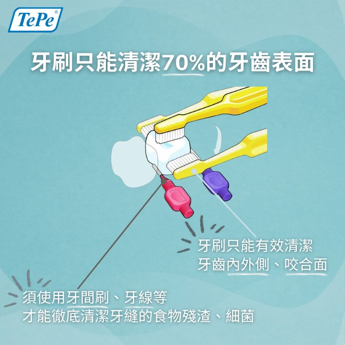
- Slide 2：「剩下 40% 藏在牙縫裡」（牙縫汙垢示意圖）
  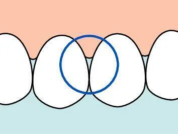
- Slide 3：「牙刷碰不到的死角 = 牙周病的溫床」
  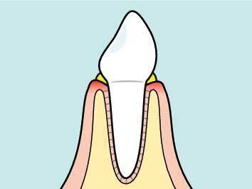
- Slide 4：「牙間刷 360° 深入牙縫清潔」（產品示意圖）
  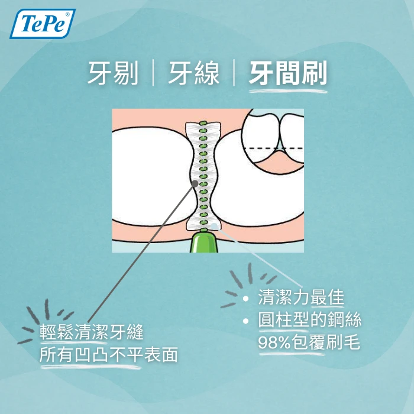
- Slide 5：「搭配牙刷，清潔率直衝 90%↑」（CTA：連結在 bio）
  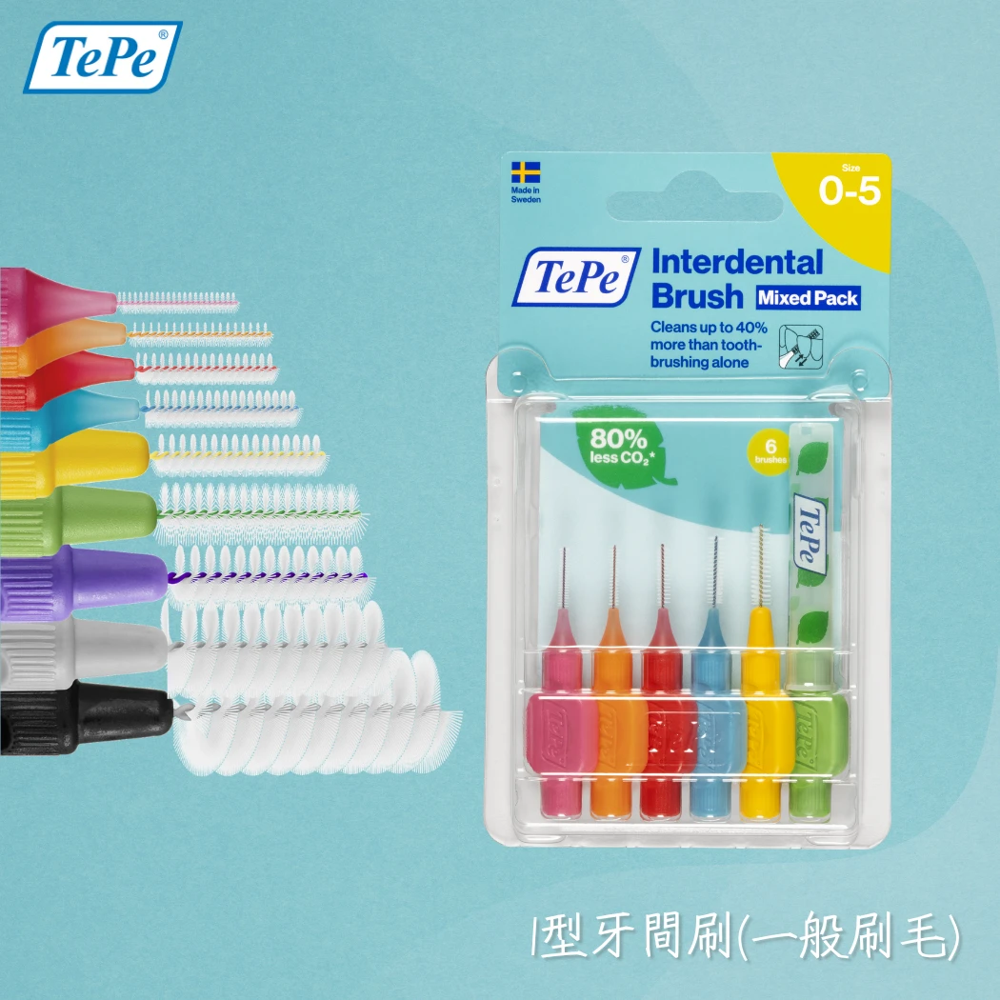

**Hashtags：**
#牙間刷 #口腔護理 #TePe #牙齒保健 #牙周病預防 #潔牙 #牙縫清潔 #刷牙 #口腔健康 #牙醫推薦 #dentalcare #oralhealth #interdental #tepebrush #健康生活

---

## Post 2：單圖知識貼 — 牙間刷 vs 牙線

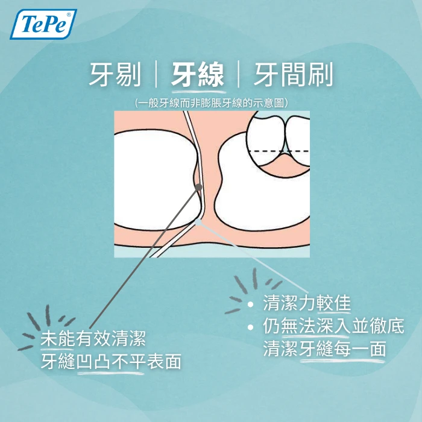

**Caption：**
牙線和牙間刷，你只用一種嗎？🤔

其實兩者各有強項 👇

🧵 牙線 → 門牙極窄牙縫
🪥 牙間刷 → 後牙較寬牙縫

牙線是「線狀」拉動清潔，只碰到表面
牙間刷是「刷毛」360° 摩擦，深入牙根凹凸處

專業牙醫的建議：兩者併用才完整 ✌️

想挑選適合你的牙間刷？連結在 bio 🔗

**Hashtags：**
#牙間刷 #牙線 #口腔護理 #TePe #牙齒保健 #潔牙工具 #牙縫清潔 #牙醫推薦 #oralcare #dentalcare #interdental #floss #健康習慣 #每日保養 #口腔健康

---

## Post 3：輪播教學貼 — 牙間刷尺寸選擇 + 正確用法

**Caption：**
牙間刷尺寸怎麼選？4 步驟怎麼用？

新手看這一篇就夠了 📖👇

TePe 用顏色分尺寸，選起來超直覺
建議先買混色包，找出你的專屬組合 🎨

正確用法的關鍵：要在刷牙「前」使用！
先清空牙縫 → 再刷牙讓氟化物滲透 💡

連結在 bio 🔗

**輪播內容建議：**
- Slide 1：「牙間刷選對尺寸很重要」（標題頁）
  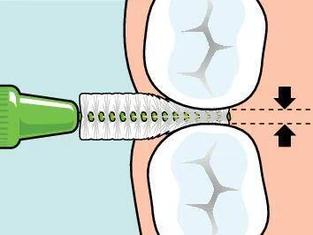
- Slide 2：尺寸色碼對照（粉紅/橘/紅/藍/黃）
  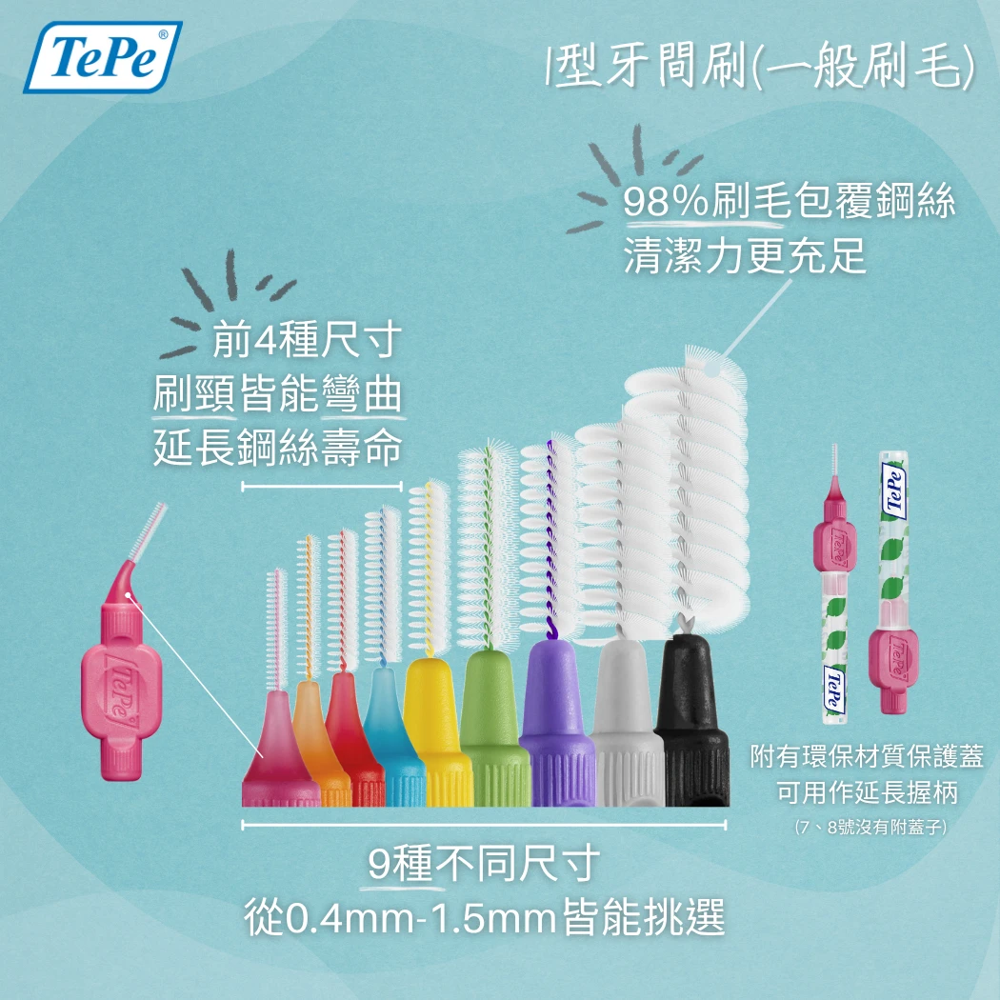
- Slide 3：「口訣：鐵絲小於齒縫，刷毛有微小摩擦」
  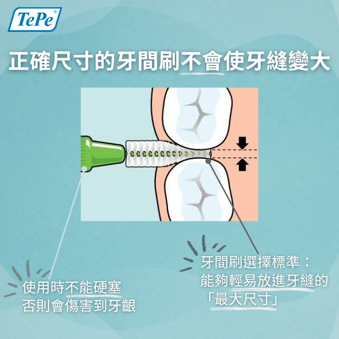
- Slide 4：步驟 1-2：對鏡定位 → 輕柔推入
  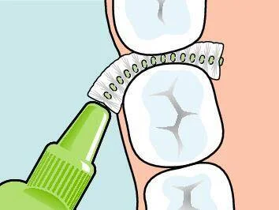
- Slide 5：步驟 3-4：水平來回 → 內外兼顧
  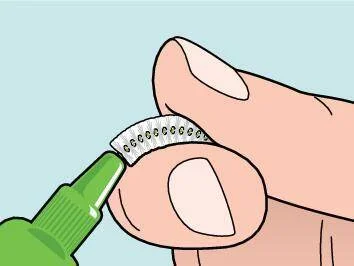
- Slide 6：「記得在刷牙前使用！」（CTA）
  

**Hashtags：**
#牙間刷 #口腔護理 #TePe #牙間刷用法 #潔牙教學 #牙齒保健 #牙縫清潔 #新手必看 #dentalcare #oralhealth #interdental #howtouse #牙醫推薦 #健康生活 #口腔健康

---

## Post 4：輪播貼文 — 這四種人最需要牙間刷

**Caption：**
你以為只有長輩才需要牙間刷？

這 4 類人更應該現在就開始用 👇

及早養成習慣，未來省下的是大筆植牙費用 💰

你是哪一類？留言告訴我 💬

連結在 bio 🔗

**輪播內容建議：**
- Slide 1：「這 4 種人最需要牙間刷」（標題頁）
  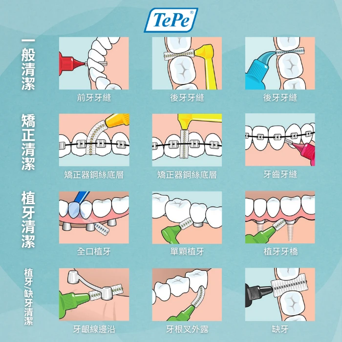
- Slide 2：牙周病患者 / 牙齦萎縮者 — 清潔黑三角區域
  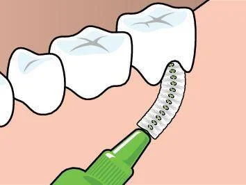
- Slide 3：矯正族（小鋼牙）— 清潔鋼絲與托架死角
  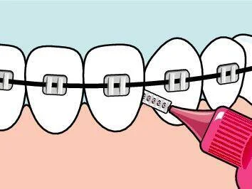
- Slide 4：植牙 / 假牙使用者 — 預防植體周圍炎
  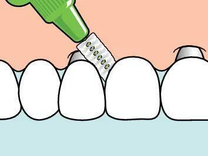
- Slide 5：追求清新口氣的你 — 口臭元兇藏在牙縫
  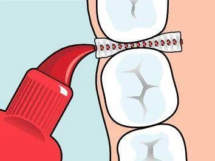

**Hashtags：**
#牙間刷 #口腔護理 #TePe #牙周病 #矯正 #植牙 #牙齒矯正 #小鋼牙 #假牙清潔 #口臭 #牙齦萎縮 #dentalcare #oralhealth #braces #dentalimplant #口腔健康

---

## Post 5：單圖知識貼 — 破解牙間刷三大迷思

**Caption：**
關於牙間刷，這三個迷思你中了幾個？🙋

❌「會讓牙縫變大」
→ 不會！是發炎消腫後的正常現象

❌「流血就該停用」
→ 初期出血代表牙齦發炎，持續用 3-5 天會改善

❌「要沾牙膏才有效」
→ 不用！物理摩擦力已足夠清除牙菌斑

別讓迷思擋住你的口腔健康之路 💙

連結在 bio 🔗

**Hashtags：**
#牙間刷 #口腔護理 #TePe #牙齒保健 #迷思破解 #牙周病預防 #潔牙 #牙縫清潔 #健康知識 #dentalcare #oralhealth #mythbusting #dentalmyths #牙醫推薦 #口腔健康
