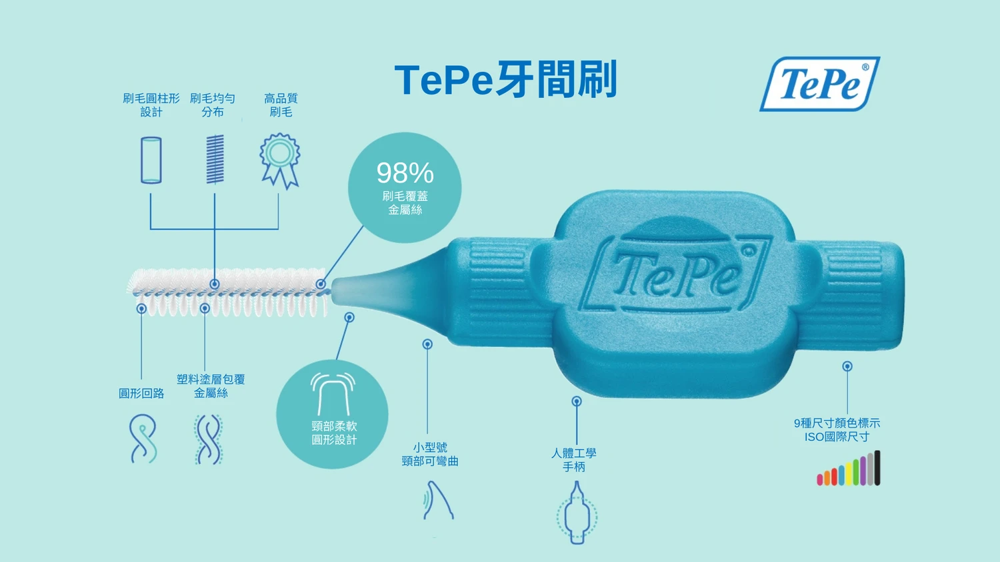

# Threads 貼文 — 牙間刷終極指南系列

---

## Post 1：你的牙齒其實只刷了 70%

每天早晚乖乖刷牙，結果去看牙醫還是被說有牙結石？

不是你不努力，是牙刷本來就只能清到 70% 的牙齒表面。

剩下 30% 全塞在牙縫裡，牙刷根本碰不到 😅

解法很簡單：加一支牙間刷。

它就像迷你版的瓶刷，推進牙縫就能 360° 把髒東西刷出來。搭配牙刷用，清潔率直接衝到 90% 以上。

試過就回不去了

👉 伸延閱讀: 【2026 牙間刷終極指南，從尺寸、挑選、到正確用法，讓你遠離牙周病與植牙危機！】
https://tepetw.com/blogs/interdental/idb-main

TePe® 牙間刷系列
https://tepetw.com/collections/idb

---

## Post 2：牙線跟牙間刷到底差在哪？

很多人問：「我有用牙線了，幹嘛還要牙間刷？」

簡單說：

牙線 → 一條線，適合門牙那種超緊的縫
牙間刷 → 小刷子，適合後牙有空間的縫

牙線只能「滑過」牙面帶走東西
牙間刷是「刷進去」把牙根凹槽的髒東西掃出來

後牙那些凹凹凸凸的地方，牙線真的清不乾淨

最佳解：門牙用牙線，後牙用牙間刷 ✌️

👉 伸延閱讀: 【2026 牙間刷終極指南，從尺寸、挑選、到正確用法，讓你遠離牙周病與植牙危機！】
https://tepetw.com/blogs/interdental/idb-main

TePe® 牙間刷系列
https://tepetw.com/collections/idb

---

## Post 3：牙間刷尺寸選不對，等於白用

選牙間刷最重要的一件事：尺寸

太小 → 刷不乾淨
太大 → 硬塞會傷牙齦

怎麼判斷？推進去的時候，刷毛要有「輕微的摩擦感」，但鐵絲不能卡住。

TePe 用顏色分尺寸，很好認：
🩷 粉紅 0.4mm 最細
🔴 紅色 0.5mm 最多人用
🔵 藍色 0.6mm 牙縫較寬

我的建議：直接買混色包回家試，通常一個人會需要 2-3 種尺寸，因為每個牙縫寬度不一樣

👉 伸延閱讀: 【2026 牙間刷終極指南，從尺寸、挑選、到正確用法，讓你遠離牙周病與植牙危機！】
https://tepetw.com/blogs/interdental/idb-main

TePe® 牙間刷系列
https://tepetw.com/collections/idb

---

## Post 4：90% 的人搞錯的事：牙間刷要在刷牙「前」用

你是不是刷完牙才用牙間刷？

順序反了 🔄

正確的是：先用牙間刷 → 再刷牙

原因很簡單：先把牙縫裡的髒東西清掉，刷牙的時候牙膏裡的氟化物才能真正跑進牙縫，發揮防蛀效果。

如果牙縫裡塞滿食物殘渣和牙菌斑，氟化物根本進不去，等於白塗。

今天開始改變順序，效果差很多 💡

👉 伸延閱讀: 【2026 牙間刷終極指南，從尺寸、挑選、到正確用法，讓你遠離牙周病與植牙危機！】
https://tepetw.com/blogs/interdental/idb-main

TePe® 牙間刷系列
https://tepetw.com/collections/idb

---

## Post 5：「用牙間刷牙縫會變大」是真的嗎？

不是。這是最常見的誤解。

用了牙間刷後覺得牙縫變大，通常是因為：
1. 原本腫脹發炎的牙齦消腫了
2. 塞滿牙結石的空間被清乾淨了

這其實是牙齦「變健康」的表現 💚

反而是不清潔牙縫 → 牙菌斑堆積 → 牙周病 → 牙槽骨流失 → 牙縫才會真正永久變大

所以因果關係剛好相反。

另外，初期用會流一點血也是正常的，代表那邊牙齦在發炎。持續用 3-5 天通常就不會了。超過兩週還在流就去看醫生 🙏

👉 伸延閱讀: 【2026 牙間刷終極指南，從尺寸、挑選、到正確用法，讓你遠離牙周病與植牙危機！】
https://tepetw.com/blogs/interdental/idb-main

TePe® 牙間刷系列
https://tepetw.com/collections/idb
