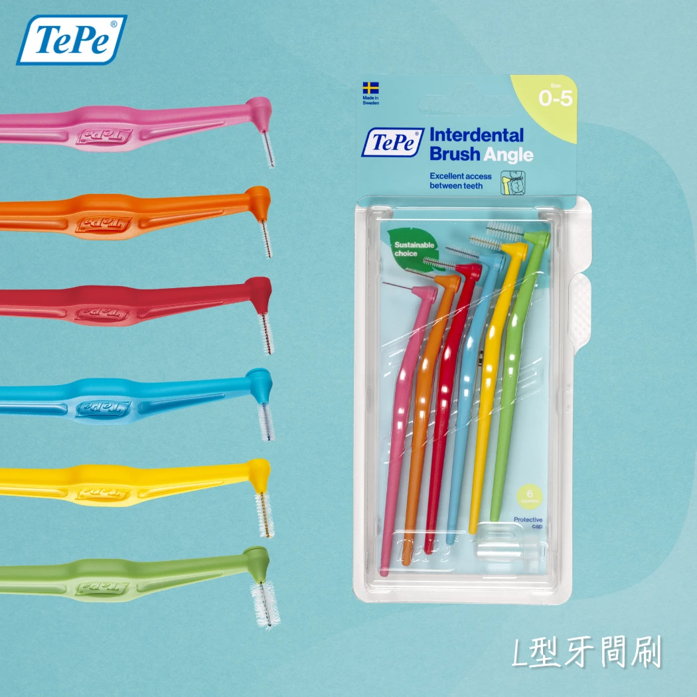

# 90% 的人搞錯了！牙間刷應該在刷牙「前」用，正確順序讓防蛀效果倍增

你每天早晚認真刷牙，卻還是蛀牙、牙齦發炎？問題很可能出在——**順序搞反了**。

大多數人的習慣是先刷牙，再用牙間刷清牙縫。聽起來合理，但牙醫研究早已證明，這個順序會大幅降低牙膏中氟化物的防蛀效果。

## 為什麼順序這麼重要？

當牙縫裡塞滿食物殘渣和細菌生物膜時，牙膏中的氟化物根本無法滲透進去。你等於讓最需要保護的 30% 牙齒表面完全暴露在蛀牙風險之下。

**正確順序應該是：牙間刷 → 牙線 → 刷牙。**

先用牙間刷把牙縫裡的大塊汙垢和細菌膜清除乾淨，讓牙縫處於「通暢」狀態。接著用牙線處理門牙等極窄鄰接面。最後才刷牙——此時牙膏中的氟化物能順利滲透進每一個牙縫，真正發揮**防蛀**和**強化琺瑯質**的作用。

<figure align="center">
  
  <figcaption>先用牙間刷清潔牙縫，為後續刷牙做好準備</figcaption>
</figure>

## 牙間刷正確使用四步驟

掌握以下步驟，就能輕鬆養成「先清牙縫、再刷牙」的好習慣：

**第一步：對鏡練習，精準定位。** 初學者建議對著鏡子操作，確認牙間刷對準牙縫入口，避免戳到牙齦。

**第二步：輕柔推入，不要硬塞。** 將牙間刷輕輕插入牙縫，若感到明顯阻力，代表尺寸太大，應換用較小號的刷頭。正確尺寸應該是進入時感到微小摩擦，但不會疼痛。

**第三步：水平來回移動 2-3 次。** 不需要旋轉，單純的水平來回動作就能有效帶走牙菌斑。

<figure align="center">
  
  <figcaption>清潔後牙時，可將牙間刷頸部微微折彎，更容易進入後牙區</figcaption>
</figure>

**第四步：內外兼顧。** 每個牙縫都要從嘴唇側（頰側）和舌頭側各刷一次，確保 360 度無死角清潔。

## 選對工具，事半功倍

如果你覺得直型牙間刷在後牙區操作困難，可以考慮使用 L 型牙間刷。角度設計讓刷頭更容易觸及後方臼齒的牙縫，不需費力折彎，單手即可輕鬆操作。

<figure align="center">
  
  <figcaption>TePe Angle L 型牙間刷，專為後牙區設計的角度握柄</figcaption>
</figure>

## 今天就改變順序

只需要一個小改變——把牙間刷移到刷牙「之前」使用——就能讓氟化物的防蛀效果大幅提升，從根本降低蛀牙和牙周病的風險。

想了解更多牙間刷的尺寸挑選和完整用法？請參考 [2026 牙間刷終極指南](idb-main)。

立即選購適合你的刷頭尺寸：[TePe 牙間刷系列](https://tepetw.com/collections/idb)
