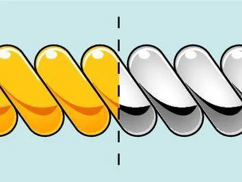

# 破解牙間刷三大迷思：牙縫變大、流血、要用牙膏？牙醫告訴你真相

牙間刷是牙醫公認最有效的齒縫清潔工具，但許多人因為常見的錯誤觀念而不敢使用。今天就來一一破解最常見的三大迷思，讓你安心守護口腔健康。

<figure align="center">
  
  <figcaption>牙間刷適用場景總覽</figcaption>
</figure>

## 迷思一：「用牙間刷會讓牙縫變大」

這是最多人擔心的問題，但答案是——絕對不會。

牙縫看起來「變大」，其實有兩個原因：第一，原本腫脹發炎的牙齦在恢復健康後自然消腫，露出了原有的齒縫空間；第二，長期堆積在牙縫的牙結石被清除後，被佔據的空間重新顯現。這些都是牙齦回復正常的表現，而非牙間刷造成的損害。

相反地，如果因為害怕牙縫變大而不清潔齒縫，牙菌斑和牙結石持續累積，反而會導致牙周病，造成齒槽骨萎縮，讓牙縫真正且永久性地擴大。

## 迷思二：「用了會流血，代表不適合使用」

初次使用牙間刷時出血，許多人會嚇到立刻停用，這其實是最不該做的事。

出血代表該處牙齦正處於慢性發炎狀態，而這正是你需要加強清潔的訊號。當你持續以正確方式使用牙間刷，通常在 3 至 5 天內，隨著發炎改善，流血就會明顯減少甚至完全停止。

<figure align="center">
  
  <figcaption>牙間刷深入清潔牙齦萎縮處外露的牙根</figcaption>
</figure>

不過，若持續使用超過兩週仍有明顯出血，建議儘快就醫檢查，排除較嚴重的牙周問題。

## 迷思三：「牙間刷需要搭配牙膏才有效」

許多人以為牙間刷和牙刷一樣，需要沾牙膏才能達到清潔效果。事實上，牙間刷的清潔原理主要依靠刷毛的物理摩擦力來破壞並移除牙菌斑生物膜，單靠乾刷已經綽綽有餘。

<figure align="center">
  
  <figcaption>TePe 塑膠包覆金屬絲 vs 未包覆金屬絲對比</figcaption>
</figure>

除非牙醫師針對特定狀況（如高蛀牙風險或牙周治療後）建議使用含氟凝膠或專用牙膏，否則一般日常使用無需額外添加任何清潔劑。

## 結語：別讓迷思阻礙你的口腔健康

牙間刷不會讓牙縫變大、出血是發炎的警訊而非停用的理由、乾刷就能有效清潔。了解真相後，現在就開始每天使用牙間刷，為你的牙齒提供最完整的保護。

想了解更多牙間刷的選擇與使用技巧，請參閱 [2026 牙間刷終極指南](idb-main)，或直接選購 [TePe 牙間刷系列](https://tepetw.com/collections/idb)。
