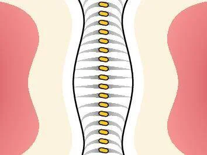

# 牙間刷 vs 牙線：兩者有何不同？牙醫建議的黃金潔牙組合

「我已經每天用牙線了，還需要牙間刷嗎？」這是許多注重口腔健康的人心中的疑問。答案是：**兩個都需要，但用途完全不同。**

## 牙刷只是基本功，牙縫清潔才是關鍵

即使你每天早晚認真刷牙，牙刷其實只能清潔約 70% 的牙齒表面。剩下的 30% 藏在牙縫深處，是牙刷刷毛無法觸及的地帶，也是牙菌斑最容易堆積、引發牙齦炎和牙周病的高風險區域。

<figure align="center">
  
  <figcaption>牙刷只能清潔約 70% 的牙齒表面，剩下 30% 需靠牙間刷與牙線輔助</figcaption>
</figure>

## 牙線的優勢與限制

牙線是一條扁平的線材，能夠滑入極度緊密的齒縫中，刮除牙齒鄰接面上的牙菌斑。對於**門牙區**那些幾乎沒有空隙的緊密接觸點，牙線是最合適的清潔工具。

然而，牙線的接觸面積有限，只能帶走齒面上的部分汙垢，對於牙根凹陷處和較寬的牙縫，清潔效率並不理想。

## 牙間刷為何更適合後牙區？

牙間刷的設計就像一支迷你瓶刷，刷毛能夠 **360 度擴張**，完整貼合牙齒表面的弧度與凹槽。當刷毛進入牙縫時，會自動適應齒面形狀，深入牙根凹陷處，將卡在死角的牙菌斑徹底清除。

<figure align="center">
  
  <figcaption>牙間刷刷毛 360 度擴張，完整貼合牙齒表面</figcaption>
</figure>

研究顯示，在有足夠間隙的後牙區，牙間刷的牙菌斑清除效率遠高於牙線。這也是為什麼歐洲牙周病學會（EFP）將牙間刷列為牙縫清潔的**首選工具**。

## 牙醫推薦的黃金組合

專業牙醫建議的最佳潔牙方案：

- **門牙區（齒縫緊密）** → 使用牙線
- **後牙區（齒縫較寬）** → 使用牙間刷

<figure align="center">
  
  <figcaption>牙間刷與牙線各有所長，搭配使用才是最完整的潔牙方案</figcaption>
</figure>

兩者併用，再搭配正確的刷牙方式，就能將口腔清潔率從 60% 大幅提升至 90% 以上，真正做到全方位的潔牙護理。

別再只靠單一工具，今天就開始你的黃金潔牙組合吧！

---

延伸閱讀：[2026 牙間刷終極指南](idb-main) | 選購：[TePe 牙間刷系列](https://tepetw.com/collections/idb)
